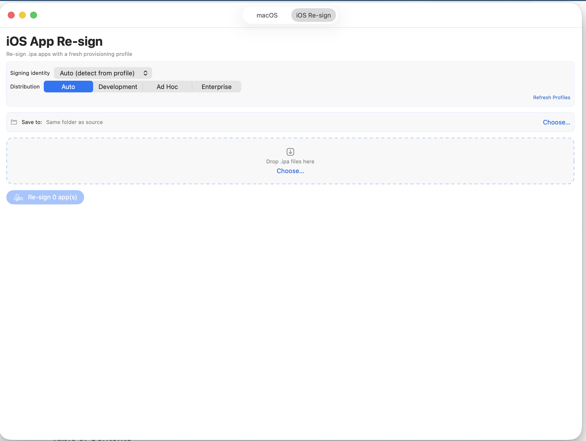

# Signaro: Advanced macOS Code Signing, Notarization & iOS Re-signing Utility

<div align="center">
  
</div>

Signaro is a professional-grade, privacy-first macOS application for code signing, notarization, stapling, and distribution of `.app`, `.pkg`, `.dmg`, and `.mobileconfig` files, plus **iOS `.ipa` re-signing** — swap in a fresh provisioning profile and re-sign every bundle inside-out, with auto-detection of the matching profile and certificate and safety guards that prevent data-losing or capability-stripping re-signs. Built with SwiftUI and a strict MVVM architecture, it shares a single operations layer between the GUI and a native companion CLI, so every guarantee that holds in the app holds in automation as well. All processing is local; no credentials, file contents, or metadata leave the device except as required by Apple's notarization service.

**Current version: 5.5 Build 1.7.8 (2026-07-06)**

## Table of Contents

- [What's New](#whats-new-in-version-55-build-178)
- [Core Features](#core-features)
  - [Code Signing](#code-signing)
  - [Notarization](#notarization)
  - [DMG Creation and Customization](#dmg-creation-and-customization)
  - [Distribution Workflows](#distribution-workflows)
  - [iOS App Re-signing](#ios-app-re-signing)
  - [Certificate Management](#certificate-management)
- [Command-Line Interface](#command-line-interface)
  - [CLI Commands](#commands)
  - [End-to-End Example (Profile-Based)](#end-to-end-example-profile-based)
- [Notarization Credential Modes](#notarization-credential-modes)
- [In-App Help](#in-app-help)
- [System Requirements](#system-requirements)
- [Troubleshooting](#troubleshooting)
- [Architecture Overview](#architecture-overview)
- [Version Information](#version-information)

---

## What's New in Version 5.5 Build 1.7.8

### In-app Help catches up with the app (Build 1.7.8)

- **Certificate renewal, fully documented.** A step-by-step "Renewing an Expiring Certificate" guide covers the Renew… flow end to end — CSR generation with the private key created in *this* Mac's login keychain (and why the issued `.cer` must be opened on the same Mac), portal upload with the same certificate type, profile regeneration afterward, and how the diagnostic explains an in-flight or misdirected renewal.
- **Lifecycle indicators explained** — the 90-day model behind the countdown pill, the *type · trust · expiry* summary line, and the `.mobileprovision` banner, on both tabs and in Auto mode.
- **Every remaining surface covered** — new sections for the Validation Mode toggle (Detailed vs Quick), the Certificate Diagnostic's three finding types (duplicates, certificates missing their private key, renewal keys awaiting a certificate), and resuming interrupted batch workflows; the Safety Guards section now lists the expired-certificate, revocation, and expired-profile hard stops, and Distribution Workflows documents Create DMG's appearance customization.

### iOS tab lifecycle parity, expired-profile hard stop (Build 1.7.7)

- **The iOS Re-sign tab now tells the full certificate and profile story at the picker** — matching the macOS tab. The signing-identity row shows the urgency pill ("32 days"), the Renew… menu (CSR generation + portal deep link), and the consolidated *type · trust · exact expiry* line — and in **Auto mode** these describe the identity your queued IPAs actually resolved to, staying visible whether cards are collapsed or expanded.
- **The detected `.mobileprovision` gets its own banner.** A severity-tinted row labeled with a `.mobileprovision` chip shows the resolved profile's name and "Expires *date* — N days" (matching the identity line's format), with **Regenerate in portal…** inline once it's inside the 90-day window — the same threshold as every other lifecycle indicator, replacing the old 14-day trigger. Redundant hint rows stand down when the banner is showing.
- **Expired provisioning profiles are now a hard stop.** The auto-matcher always filtered them, but a drag-in `.mobileprovision` override (or a cached analysis) could carry an expired profile straight through to a successful-looking re-sign that failed at install. Analysis now predicts **Blocked** with the expiry date and full remediation (regenerate in portal → Xcode → Download Manual Profiles), nested-bundle overrides included, re-enforced at sign time — and the CLI's `ios analyze`/`ios resign` inherit it.

### Orphaned-certificate detection (Build 1.7.6)

- **"My certificate is in the keychain but Signaro doesn't list it" — now explained.** A signing certificate whose private key is missing can never appear in the certificate picker (macOS only enumerates cert+key *pairs*), while Keychain Access shows it plainly — the classic confusion after moving Macs, and the failure mode of Renew… when the issued certificate is downloaded on a different Mac than the one that generated the CSR. Signaro now scans for these orphans: an orange hint appears under the picker, and the stethoscope diagnostic lists each orphaned certificate with the fix (export a `.p12` from the originating Mac, or renew from here). Expired orphans are ignored — they're cleanup clutter, not blockers.
- **Renewal keys are tracked to completion.** The diagnostic also lists Renew…-generated private keys still waiting for their certificate, so an in-flight renewal is visible and an abandoned one is identifiable (and safe to delete).

### Certificate lifecycle at a glance, and in-app renewal (Build 1.7.5)

- **Expiry always one glance away.** The certificate picker's status rows are consolidated into a single metadata line — *type · trust · exact expiry* ("Developer ID Application · Trusted · Valid until Jul 5, 2027"). Inside the 90-day window the line turns amber and names the date and countdown; expired turns red; an untrusted certificate escalates the line even when its dates are fine — the summary can never look healthier than the warning pill above it.
- **Status pill now actually appears — and only when it matters.** The countdown pill next to the picker never rendered before: it lived inside the menu button's label, which macOS flattens to icon + text, silently dropping styled views. It now sits beside the picker and appears from the 90-day advisory window onward ("32 days", "Expired") — quiet when healthy, so its arrival is the signal.
- **Renew… from the app.** When the selected certificate is expiring or expired, a Renew… menu appears: *Generate CSR & Open Portal…* creates a 2048-bit RSA key pair **in your login keychain** (so the certificate Apple issues pairs into a working identity), saves a portal-ready `.certSigningRequest`, reveals it in Finder, and opens the developer portal's create-certificate page. CSR generation is built in (PKCS#10, verified against `openssl req -verify`) — no Keychain Access round-trip.

### Signing safety hardening and CLI validate fix (Build 1.7.4)

- **Expired-certificate hard stop for iOS re-signing.** An expired signing certificate signs cleanly and passes local `codesign --verify`, but the resulting IPA fails to install on every device. Re-signing with one is now **Blocked** at analysis (with the expiry date and remediation in the message) and refused again at sign time. The check reads the certificate's expiry from the keychain *and* from the authoritative DER copy embedded in the provisioning profile — so a stale profile whose embedded certificate has expired is caught even when keychain metadata is missing. Expired identities remain visible in the picker with their ⚠ EXPIRED tag so the situation is explainable; "expires soon" remains advisory.
- **Nested-bundle entitlement preservation (macOS signing).** Helpers, XPC services, and extensions inside a `.app` now get fail-closed entitlement handling: if their existing entitlements cannot be extracted, signing stops instead of silently stripping them, and after signing each nested bundle Signaro re-reads what was actually written and verifies every intended entitlement key survived.
- **Per-bundle post-sign entitlement verification (iOS re-signing).** The intended-vs-written entitlement check now runs for every nested `.appex` and Watch bundle, not just the main app — dropped keys surface as a Degraded status instead of passing silently.
- **Certificate revocation blocking in the signing flows.** The OCSP revocation checker (previously opt-in via `SignaroCLI identities list --check-revocation`) is now consulted automatically: iOS re-sign analysis runs it concurrently with the rest of the analysis and shows **Blocked** on an affirmative revocation, sign time re-enforces it, and the notarization readiness check treats a revoked selected certificate as a critical issue — before a doomed notarize round-trip. Soft-fail is preserved: only an affirmative "revoked" verdict blocks; network trouble or an unreachable responder never does.
- **Fixed: `SignaroCLI validate` hang.** `validate` (and the GUI's comprehensive validation, which shares the code path) could hang indefinitely due to a lost process-exit notification in a bespoke process runner; it also had a latent deadlock on outputs over 64 KB. Both are gone — the checker now uses the same hardened process runner as the rest of the app.

### Connected devices, team registry, and revocation checks (Build 1.7.3)

- **Check This Mac's Devices** — one click in the UDID coverage section fills the coverage field with the UDID of every device paired with this Mac via `devicectl` (iOS 17+, Xcode 15+), deduplicated and preserving hand-typed entries. Rows for known devices show the device name and connection state. Manual UDID pasting remains fully supported.
- **Install on Device…** — after a successful re-sign of an Ad Hoc, Development, or Enterprise IPA, install the output directly onto a connected device. A successful on-device install is the ground-truth verification that a re-sign worked; blocked installs are explained up front (device not connected, UDID not in profile, Developer Mode off). CLI: `SignaroCLI ios install <ipa> --device <udid-or-name>` and `SignaroCLI devices list`.
- **Team device registry (read-only App Store Connect)** — `SignaroCLI devices registered` lists the devices registered to your team using an ASC API key (App Manager/Admin role); `--udid` cross-checks specific UDIDs and tells you whether a profile is merely stale or the device was never registered. Device registration and profile regeneration are deliberately not implemented (quota-consuming, team-visible actions).
- **Certificate revocation check** — `SignaroCLI identities list --check-revocation` verifies each certificate against Apple's OCSP responder. A revoked certificate signs cleanly but fails later at Gatekeeper/notarization; this catches it up front. Soft-fail: network trouble is never reported as a revocation.
- **In-app Help** — new sections covering connected devices, on-device install, the team registry (including step-by-step ASC API key creation and the App Manager role caveat), and the revocation check.
- **Fixed:** the auth-mode picker in the notarization/distribution credential dialogs no longer triggers SwiftUI's "Publishing changes from within view updates" runtime warning (re-entrant publish from the rebuilt picker's no-op selection write).

---

## What's New in Version 5.5 Build 1.7.2

### Provisioning profile classification and debug signing fixes (Build 1.7.2)

- **Ad Hoc profile misclassification fixed** — provisioning profiles with a `ProvisionedDevices` key present but an empty device list were incorrectly classified as App Store. The type waterfall now tests whether the key exists in the plist (not whether the array is non-empty), so zero-device Ad Hoc profiles resolve correctly to the Ad Hoc distribution type.
- **Empty-device Ad Hoc/Development warning** — when an Ad Hoc or Development profile has no registered devices, the analysis card now shows an explicit warning: the re-signed IPA cannot install on any device. Previously `codesign --verify` still reported success, producing a silently uninstallable IPA with no user-visible indication of the problem.
- **Debugger attachment fixed (Hardened Runtime + Manual signing)** — added `Signaro-Debug.entitlements` with `com.apple.security.get-task-allow = true` for the Debug build configuration. With Hardened Runtime enabled and Manual signing active, Xcode does not auto-inject this entitlement; the missing entitlement was causing every debug session to be killed immediately (`os/kern failure 0x5`, exit code 9). The Release configuration retains the original `Signaro.entitlements` (without `get-task-allow`) to keep notarization clean.
- **Malformed `ProvisionedDevices` type-mismatch fixed** — profiles where the `ProvisionedDevices` key holds a non-`[String]` value now fall through to App Store classification rather than silently becoming Ad Hoc with an empty device list.

---

## What's New in Version 5.5 Build 1.7.1

### OTA manifest generation + IPA routing fix (Build 1.7.1)

- **OTA Manifest…** — After a successful re-sign, the analysis card exposes an **OTA Manifest…** button for Ad Hoc, Development, and Enterprise profiles (not App Store). Enter the HTTPS URL where the re-signed `.ipa` will be hosted; Signaro writes two files alongside it: `manifest.plist` (Apple's `itms-services://` plist format) and `install.html` (a tap-to-install web page). Users visiting `install.html` in Safari on their device can tap one link to install the app directly — no MDM enrollment required for Ad Hoc and Enterprise targets. Requires HTTPS; the OTA install link format is `itms-services://?action=download-manifest&url=<hosted-manifest-url>`.
- **CLI `--ota-url`** — `SignaroCLI ios resign MyApp.ipa --ota-url https://…/MyApp.resigned.ipa` generates `manifest.plist` and `install.html` alongside the output IPA and prints the `itms-services://` install link to stdout. Requires a single input IPA (each IPA needs its own hosted URL). Requires HTTPS.
- **IPA routing race eliminated** — File ▸ Open… (⌘O) and drag-and-drop now store pending `.ipa` URLs in `@State` above the TabView and deliver them to `IPAResignView` via `@Binding`. Previously, `signaroSwitchToIOSTab` + `signaroOpenIPAURLs` were posted in rapid succession; `IPAResignView` was not yet subscribed when the second notification fired and files were silently dropped. The binding pattern has no subscription timing window.

---

## What's New in Version 5.5 Build 1.7.0

### iOS Re-sign enhancements (Build 1.7.0)

A comprehensive UX and safety pass on the **iOS Re-sign** tab:

- **Distribution type selector** — Development / Ad Hoc / Enterprise segmented picker above the queue. Filters profile matching to the chosen type; Auto (default) picks the best available.
- **Apple Distribution identities in picker** — both `Apple Development` and `Apple Distribution` certificates appear in the signing identity picker, covering Ad Hoc workflows that use a Distribution cert.
- **Per-nested-bundle profile status rows with drag-drop override** — app extensions and embedded Watch apps each show their own matched-profile status row. Drop a `.mobileprovision` onto any row to override that bundle's profile independently.
- **Post-resign codesign verification** — `codesign --verify --deep --strict` runs after each re-sign; result appears as a green or red shield badge in the analysis card.
- **Entitlement diff with delta values** — changed/dropped/added keys now show the actual value change as a secondary italic line (e.g., `false → true`, `removed com.example.group`).
- **Wildcard profile warning** — when a wildcard profile (`*`) is auto-selected, a callout warns that capabilities requiring an explicit App ID (Push Notifications, Associated Domains, PassKit, HealthKit) may not be active at runtime.
- **Expired profile surface** — the "no profile" guide reports how many matching profiles are expired, with a prompt to re-download via Xcode.
- **App Store profile detection** — the "no profile" guide explains when App Store profiles are installed but can't be used for local re-signing, and directs users to install a Development or Ad Hoc profile.
- **Ad Hoc UDID coverage check** — paste device UDIDs into the analysis card to see which are covered by the Ad Hoc profile's provisioned device list.
- **Entitlement write verification** — after resign, reads back the embedded entitlements and flags any that didn't survive the codesign step.
- **Refresh Profiles button** — forces a re-scan of both provisioning-profile directories and re-runs analysis on all queued IPAs without restarting the app.
- **Per-IPA resign progress indicator** — the card of the IPA actively being re-signed shows a spinner during a batch run.
- **Cert picker expiry warnings** — identities that are expired or expiring within 14 days are labelled `⚠ EXPIRED` / `⚠ expires soon` directly in the picker.
- **Parallel analysis** — `reanalyzeAll()` now runs all queued IPAs concurrently via `withTaskGroup`.
- **Batch resign summary row** — after a batch (or cancellation), a summary bar shows total Valid / Degraded / Failed counts.
- **Cancel button during batch resign** — replaces Clear during an active batch; stops cleanly after the current IPA finishes.
- **Multi-IPA profile hint shows aggregate** — signing card header shows "N of M profiles resolved" (with a warning when any are missing) instead of only the first IPA's profile.
- **`get-task-allow` Degraded explanation** — when Predicted Degraded is solely because `get-task-allow` changed `false → true` (distribution → development re-sign), a contextual callout explains this is expected and the app will install and run normally.
- **`@Observable` migration** — `IPAResignViewModel` migrated from `ObservableObject`+`@Published` to the `@Observable` macro, eliminating "Publishing changes from within view updates" runtime warnings.
- **Team ID unreadable → degraded not blocked** — when the original team ID can't be read, the outcome is `degraded` (re-sign proceeds with a warning) rather than `blocked`.
- **Expansion-aware header hint** — when a card is expanded, the global signing header shows that card's specific resolved profile + identity. Two or more expanded cards → aggregate of just those cards.
- **UDID coverage checker for Development profiles** — the device UDID checker (previously Ad Hoc only) now also appears for Development profiles, which also have a provisioned device list.
- **Codesign-injected keys excluded from parity diff** — `application-identifier` and `com.apple.developer.team-identifier` are always rewritten by codesign from the profile; comparing them was false-positive noise. Skipped.
- **Cosmetic allow-list expanded** — `beta-reports-active` (TestFlight crash reporting) and `com.apple.developer.default-data-protection` (file protection class) added; TestFlight IPAs and common production apps that set a data protection class are no longer blocked.
- **Double unzip eliminated** — `resign()` reuses the pre-computed `IPAAnalysis` from the analysis card instead of unzipping the IPA a second time; faster batch resigns and guaranteed analysis/sign consistency.
- **Correct cert preference for Ad Hoc / Enterprise** — `IdentityResolver` now prefers `Apple Distribution` certs when the resolved profile is Ad Hoc or Enterprise (was always preferring `Apple Development`, causing false "Predicted Valid" with Distribution profiles).
- **Output collision handling** — if the resigned `.ipa` path already exists, the output gets a numeric suffix (`-2`, `-3`) instead of silently overwriting the previous file.
- **Sub-bundle signing progress** — during resign the status line updates per target: `Signing MyExtension.appex…`, `Signing MyApp.app…`.
- **Work dir in Finder on failure** — a "Show work dir in Finder" button appears on failed resigns, linking directly to the retained working directory for diagnosis.
- **Profile discovery cached** — `ProvisioningProfileStore.discover()` runs once per refresh cycle (not once per IPA per analyze/resign call); large profile stores no longer cause multi-second hangs on every queue change.
- **Apple TSA timestamp for provisioning targets** — provisioning-bundle codesign calls now use Apple's RFC 3161 timestamp server so signed apps remain installable after the signing cert expires. Falls back to `--timestamp=none` (degraded) if the TSA is unreachable offline.
- **FairPlay encrypted binary detection** — before reading entitlements, `otool -l` checks the main binary for `cryptid != 0`; FairPlay-encrypted App Store binaries produce an actionable blocked message instead of a cryptic "Analysis failed".
- **Codesign retry** — transient `amfid`/security-framework failures are retried once with a 500 ms delay; logged in the bundle report notes.
- **Cached resolved profile** — `IPAAnalysis` carries the matched `ProvisioningProfile` so `resign()` uses the same profile previewed in the parity check rather than re-matching at sign time.

### Carried over from Build 1.6.0 — iOS `.ipa` re-signing

Signaro re-signs iOS `.ipa` apps, not just macOS artifacts. Drop (or **File ▸ Open…**, ⌘O, or **Choose…**) an `.ipa` into the **iOS Re-sign** tab and Signaro:

- **Auto-detects** the matching iOS provisioning profile (by bundle ID, iOS platform, non-expired) and the signing certificate that profile authorizes — no manual identity picking ("Auto (detect from profile)" is the default).
- **Pre-flight analysis** previews the outcome *before* signing — predicted **Valid / Degraded / Blocked** with the resolved profile + identity, original team, entitlements, nested bundles, capability-parity result, and **profile + certificate expiry** (with an amber/red badge when expiring soon or expired).
- **Re-signs inside-out** (frameworks → app extensions / Watch app → main app), signs by SHA-1 with `--timestamp=none`, embeds the fresh profile, and writes value-level expanded entitlements.
- **Safety guards:** same-team enforcement (a cross-team re-sign ships as a new app and loses data — blocked), and deny-by-default value-level **capability parity** (any dropped/weakened entitlement blocks unless it is purely cosmetic).
- **Batch queue** with per-app results, remove/clear, and Reveal-in-Finder for the output.
- Reads profiles from both the legacy `~/Library/MobileDevice/Provisioning Profiles` and the current `~/Library/Developer/Xcode/UserData/Provisioning Profiles` (macOS 13+).
- Available in the **CLI** too: `signaro ios analyze <ipa>` and `signaro ios resign <ipa>` (see [Commands](#commands)).

The macOS signing/notarization pipeline is unchanged. See [iOS App Re-signing](#ios-app-re-signing).

For Build 1.5.x and earlier release notes, see [RELEASE_NOTES.md](RELEASE_NOTES.md).

---

### Build 1.5 — Create DMG workflow overhaul

Complete overhaul of the standalone Create DMG dialog — full workflow parity with App Distribution and PKG Distribution, including a step-based progress view, post-creation signing and notarization, live Apple status feedback, and automatic certificate selection.

- **New: Step-based workflow progress view.** When Create DMG is tapped, the configuration form switches to a step-list view identical to App Distribution — each step (Create DMG → Sign DMG → Notarize DMG → Staple DMG) ticks from pending circle to spinner to checkmark/xmark in real time. A running-step banner shows current detail text; a final result banner appears on completion. The separate success alert is gone.
- **New: Sign, notarize, and staple from the Create DMG dialog.** A "Post-Creation Actions" section appears when a compatible Developer ID Application certificate is selected. Toggle **Sign DMG** to code-sign after creation. Enable **Submit for notarization** (requires credentials) to submit to Apple and wait for approval, with an optional **Staple ticket** step to embed the ticket for offline Gatekeeper assessment.
- **New: Live Apple notarization status and request ID.** The Notarize DMG step row shows Apple's submission request ID, per-step duration, and the acceptance or rejection message inline — no need to open the Log Viewer to see what Apple returned.
- **New: DMG creation logged to Operation Logs.** The Create DMG step is now a `DMG_CREATION` entry in the Operation Logs viewer, completing a full four-entry audit trail (create → sign → notarize → staple) per workflow run.
- **New: Automatic certificate selection.** When the Create DMG dialog opens, the app auto-selects the best available Developer ID Application certificate regardless of what is active in the main view, preventing the "Incompatible certificate" warning on open.
- **Fixed: Multi-file DMG icon layout positions all items.** When creating a DMG from multiple files with custom icon positions, only the first file was being placed. All entries in the icon positions map are now applied across all DMG creation paths.
- **Fixed: Create DMG output filename follows Volume Name.** Leaving File Name empty now produces a `.dmg` named from the Volume Name instead of falling back to `Archive.dmg`.
- **Fixed: DMG preview layout recursion warning.** Preview auto-expand size updates are deferred to the next main-loop tick across standalone Create DMG, App Distribution, and PKG Distribution.
- **Fixed: Notarization pre-flight failures now appear in Operation Logs.** Files that fail internal validation before reaching Apple (unsigned binary, missing hardened runtime, etc.) now log a failure entry in Operation Logs, consistent with how App Distribution records failures.

> For older release notes and historical updates, please see [RELEASE_NOTES.md](RELEASE_NOTES.md).

---

## Core Features

### Code Signing


- **In-place and copy-based signing** using `codesign` with hardened-runtime entitlements (`--options=runtime`) for notarization compatibility. Supports Developer ID Application and Developer ID Installer certificate classes.
- **Split-aware signing for mixed selections.** When the file list contains both app-type (`.app`, `.dmg`) and installer-type (`.pkg`, `.mobileconfig`) files, each file is signed with the certificate class that matches its type.

| File Type | Extension | Certificate Class |
|:---|:---|:---|
| **App Bundles** | `.app` | Developer ID Application |
| **Disk Images** | `.dmg` | Developer ID Application |
| **Installers** | `.pkg` | Developer ID Installer |
| **Config Profiles** | `.mobileconfig` | Developer ID Installer |

- **Extended attributes cleaning** (`xattr -cr`) before signing, ensuring no quarantine flags or third-party metadata interferes with notarization assessment.
- **Batch signing engine with checkpoint resume (v4.8+).** `BatchSigningCoordinator` processes files sequentially, publishes per-file live progress, saves a checkpoint after each success, and pauses on failure so the run is resumable from the exact failure point at next launch.

### Notarization


- **Full Apple notarization pipeline** via `notarytool submit` + polling loop + `stapler staple`. Supports all three Apple credential modes: Apple ID + app-specific password, Keychain Profile (`notarytool store-credentials`), and App Store Connect API Key (`.p8`).
- **Notarization requirements validation.** Pre-submission static analysis checks the signed binary's hardened runtime flag, entitlement safety, code signature validity, minimum OS version, bundle structure, and `Info.plist` completeness — surfacing issues before they cause Apple to reject the submission.
- **Entitlement & Profile Inspector (v4.6+).** Side-by-side diff between the entitlements embedded in a signed `.app` and any `.mobileprovision` profile, with orange highlighting on mismatches and risky-entitlement advisory text.

### DMG Creation and Customization

Professional disk image creation with full Finder layout customization via a mount-customize-convert pipeline (`hdiutil create -type UDIF` → R/W mount → Finder AppleScript layout → `hdiutil convert`).


- **Volume icon** (`.icns`): written to `<mount>/.VolumeIcon.icns`; `kHasCustomIcon` set via the `com.apple.FinderInfo` xattr.
- **Background image**: staged to `<mount>/.background/` and referenced via Finder AppleScript `set background picture of opts`.
- **Window geometry**: bounds, icon size (16–128 px), text size (10–16 pt), and per-file icon positions via AppleScript `set position of item`.
- **Encryption**: AES-128 and AES-256, with password piped via stdin to avoid shell-history exposure.
- **Segmentation**: `hdiutil convert -segmentSize` for split DMG sets.
- **Inline live preview**: Drag-to-position editing of icon placements with grid overlay, rulers, snap-to-guides, and auto-expand when icons are dragged beyond the current window bounds. Persistent per-surface presentation preferences via `@AppStorage`. A Preferences action resets presentation defaults for all three DMG surfaces simultaneously.
- **Output filename follows the volume name by default.** In the standalone Create DMG dialog, leaving File Name empty makes the produced `.dmg` use the current Volume Name, with `.dmg` appended automatically. Entering a File Name still overrides this behavior.
- **All three DMG surfaces at full parity (v5.0+).** App Distribution workflow dialog, PKG Distribution workflow dialog, and the standalone Create DMG dialog all expose the same inline preview and layout controls. No separate sheet.

### Distribution Workflows


- **App Distribution Workflow**: sign → notarize → staple → create DMG → sign DMG → notarize DMG → staple DMG. Full step-by-step progress with per-step result detail. The workflow supports `skipNotarizeAndStaple` for offline or pre-notarized scenarios, and `cleanExtendedAttributes` for files that carry quarantine or third-party xattrs.
- **PKG Distribution Workflow**: sign `.pkg` with `productsign` → notarize → staple → optionally create a distribution DMG → sign DMG → notarize DMG → staple DMG. The DMG created for a PKG uses the signed `.pkg` path as its single source, with all advanced layout options available.
- **Distribute All with per-file DMG customization (v5.0+).** `BatchDistributionCoordinator` fans out through the full file list, routing each file to the appropriate workflow (`AppDistributionService` or `PkgDistributionService`) with its own `DMGFileSettings`. Checkpoint/resume mirrors the batch signing engine.
- **Workflow checkpoint resume (v4.0+).** `WorkflowCheckpointStore` persists completed step IDs and execution context (credential snapshot, output paths) after every step. At next launch, `PendingWorkflowCheckpointsBanner` appears with a Resume button that restarts from the last completed step without re-executing already-finished work.

### iOS App Re-signing



A dedicated **iOS Re-sign** tab (and matching CLI commands) re-signs iOS `.ipa` apps with a fresh provisioning profile. It is a separate path from the macOS pipeline — `.ipa` is always iOS — and reuses the same `LocalProcessRunner`/`codesign`/`security` operations layer.

- **Add an `.ipa`** by drag-and-drop, the drop zone's **Choose…** button, or **File ▸ Open… (⌘O)**. ⌘O is type-aware: it routes `.ipa` to this tab and `.app`/`.dmg`/`.pkg`/`.mobileconfig` to the macOS tab, switching tabs automatically.
- **Auto-detection.** `ProvisioningProfileStore` discovers installed profiles (scanning both `~/Library/MobileDevice/Provisioning Profiles` and the macOS 13+ `~/Library/Developer/Xcode/UserData/Provisioning Profiles`), matches the app's bundle ID to an iOS, non-expired profile (concrete preferred over wildcard, then newest), and `IdentityResolver` picks the keychain identity that profile authorizes. The identity picker defaults to **Auto (detect from profile)**; a specific Apple Development identity can be chosen to override.
- **Pre-flight dry-run analysis.** Before any signing, each queued `.ipa` shows a predicted **Valid / Degraded / Blocked** badge with the resolved profile + identity, original team and authority, original entitlements, nested provisioning bundles (validated too), the capability-parity result, and **profile + certificate expiry** (amber within 14 days, red when expired — also flagged on the collapsed row). The engine runs the same read-only `analyze()` that `resign()` uses, so the preview never diverges from the result.
- **Signing.** Inside-out order (deepest frameworks/dylibs first → app extensions / Watch app → main app last); frameworks/dylibs are code-only (no profile or entitlements); each provisioning bundle gets a fresh `embedded.mobileprovision` and value-level, wildcard-expanded entitlements; provisioning-bundle targets are signed using Apple's RFC 3161 timestamp server (apps remain installable after cert expiry; falls back to `--timestamp=none` offline); xattrs stripped first; Payload re-zipped; final `codesign --verify --deep --strict`.
- **Safety guards.** **Same-team enforcement** — a cross-team re-sign installs as a new app on device (data loss), so it is blocked (fail-closed if the original team can't be read). **Deny-by-default value-level capability parity** — any removed or weakened entitlement blocks the re-sign unless its key is on a deliberately narrow cosmetic allow-list (`get-task-allow`, `beta-reports-active`, `com.apple.developer.default-data-protection`, codesign-injected keys); the original entitlements are read fail-closed so a parity check can never be silently skipped. **FairPlay-encrypted binaries** are detected early (via `otool -l`) and blocked with an actionable message.
- **Distribution type selector.** A Development / Ad Hoc / Enterprise segmented picker above the queue filters profile matching to the chosen type. Auto (default) picks the best available match.
- **Per-nested-bundle status + drag-drop override.** App extensions and Watch apps each show their own matched-profile row in the analysis card. Drop a `.mobileprovision` onto any row to override that bundle's profile independently.
- **Post-resign codesign verification.** After each re-sign, `codesign --verify --deep --strict` is run and the result appears as a green ✓ or red ✗ shield badge.
- **Entitlement diff with delta values.** The entitlement diff shows changed/dropped/added keys with the actual value change as a secondary italic line (e.g., `false → true`).
- **Wildcard profile warning.** When a wildcard `*` profile is auto-selected, a callout warns that Push Notifications, Associated Domains, PassKit, and HealthKit may not be active at runtime.
- **Expired profile surface + App Store profile detection.** The "no profile" guide reports expired candidate counts and explains when App Store profiles are installed but can't be used for local re-signing.
- **UDID coverage check.** Paste device UDIDs in the card to see which are covered by the profile's provisioned device list. Shown for both Ad Hoc and Development profiles. A **Check This Mac's Devices** button asks `devicectl` for every device paired with this Mac (iOS 17+) and fills their UDIDs into the coverage field automatically (deduplicated, preserving anything already typed); rows for known devices are annotated with the device name and connection state.
- **Install on Device.** After a successful re-sign of an Ad Hoc, Development, or Enterprise IPA, an **Install on Device…** button lists the devices this Mac knows and installs the output IPA directly via `devicectl` — the ground-truth verification that a re-signed IPA actually works. Blocked installs are explained up front (device not connected, UDID not in the profile, Developer Mode off). Also available as `SignaroCLI ios install <ipa> --device <udid>`.
- **Entitlement write verification.** After resign, Signaro reads back the embedded entitlements and flags any that didn't survive the codesign step.
- **Refresh Profiles button.** Forces a re-scan of provisioning-profile directories and re-runs analysis on all queued IPAs without restarting.
- **Per-IPA resign progress spinner.** The card of the IPA actively being re-signed shows a spinner during a batch.
- **Cert picker expiry warnings.** Expired or soon-expiring identities are labelled `⚠ EXPIRED` / `⚠ expires soon` in the picker.
- **Batch resign summary + Cancel button.** After a batch, a summary bar shows Valid / Degraded / Failed counts. During a batch, a Cancel button (replacing Clear) stops the run cleanly after the current IPA.
- **OTA manifest generation.** After a successful re-sign, an **OTA Manifest…** button appears on the analysis card for Ad Hoc, Development, and Enterprise profiles. Enter the HTTPS URL where the re-signed `.ipa` will be hosted. Signaro generates `manifest.plist` (Apple OTA format) and `install.html` (a tap-to-install page with an `itms-services://` deep link) alongside the output file. The install link is `itms-services://?action=download-manifest&url=<hosted-manifest-url>`. Host both files on any HTTPS server; users tap the link in Safari on their iOS device to install. Also available via `SignaroCLI ios resign … --ota-url <https://…/app.ipa>`.
- **Batch & results.** Queue multiple `.ipa`s (concurrent analysis, sequential re-sign, failure-isolated); per-app result badges; remove a single item (✕) or **Clear** the queue; **Reveal** the re-signed `.ipa` in Finder. Output is written as `<name>.resigned.ipa` next to the input (suffix `-2`, `-3`, … if a previous resigned file already exists). On failure, a **Show work dir in Finder** button links to the retained working directory for diagnosis.

> Re-signing requires a non-sandboxed build (it spawns `codesign`/`security` and reads the profiles directory and keychain). A `codesign --verify`-clean signature is correctly signed. Installability on a device depends on distribution type: **Ad Hoc** and **Development** profiles contain a provisioned-device list (UDIDs must be registered in the Apple Developer portal and baked into the profile); **Enterprise** profiles allow installation on any device in the organization without a UDID list; **App Store** profiles are for local signing only and require distributing via App Store Connect.

### Certificate Management

- **Workflow-aware auto-select (v4.7+).** Distribution dialog openings trigger `bestIdentity(for:)`, which filters identities by workflow type, excludes expired certificates (but not expiring-imminently ones), and prefers the identity last used for that specific workflow.
- **Per-workflow identity history.** App distribution and PKG distribution each maintain an independent last-used identity key, preventing cross-workflow history pollution.
- **Certificate Status Pill.** The selected Developer ID identity displays a days-until-expiry pill with escalating color: neutral ≥ 90 days; advisory 30–89; warning 7–29; error < 7 or expired.
- **Expiry monitoring and notifications.** `CertificateLifecycleMonitor` evaluates every discovered Developer ID identity on launch and on a daily schedule. Approaching-expiry conditions post macOS User Notifications (permission requested on first launch) and surface inline banners in the distribution dialogs.

### Working Folders


- **Named project folders** that group related files together for batch operations. Persistent across launches via `WorkingFolderManager`.
- **Sign All (v4.8+).** Signs every unsigned file in the folder, routing each to the correct certificate class automatically. Available in the GUI (folder manager) and CLI via `folder sign <dir>`. Spinner feedback during signing; status pills update in place after completion.
- **Sidebar integration.** When Working Folders mode is active, the main view adopts a two-column layout with folders in the leading sidebar. A direct toolbar button (v5.0+) toggles the sidebar without navigating to the overflow menu.

### Submission History & Analytics

- **Submission History Browser (v4.6+).** Structured, searchable record of every operation, browsable from the Submission Log window or via `history list` in the CLI. Filter by operation type, search by filename or UUID, toggle failures-only, copy request IDs to the clipboard.
- **Distribution Analytics.** On-device metrics store (`DistributionMetricsStore`) backed by `SubmissionLogger`. Aggregates submission counts, notarization durations, and failure classes. Exportable as CSV or JSON from the Analytics tab in Preferences. Strictly local — no data leaves the device.
- **Retry Policy.** Bounded exponential backoff with jitter around `notarytool submit`, with classification of retryable (5xx, DNS, timeout) versus fatal (4xx, authentication) conditions. Stapler error 65 is retried.

---

## Command-Line Interface

`SignaroCLI` is a native macOS executable built from the same Xcode project as the GUI application. It shares `CodeSigningOperations`, `NotarizationOperations`, `DMGCreationOperations`, `AppDistributionWorkflow`, and `PkgDistributionWorkflow` directly — no separate implementation, no shell-script wrappers. All commands are non-interactive by default and suitable for CI and automated build pipelines.

### Build

```bash
xcodebuild build \
  -project Signaro.xcodeproj \
  -scheme SignaroCLI \
  -destination 'platform=macOS'
```

Verify the build:

```bash
SignaroCLI --version    # → SignaroCLI 5.5 Build 1.7.8
SignaroCLI --help
```

<details>
<summary>Click to view <code>SignaroCLI --help</code> output</summary>

```text
OVERVIEW: Signaro Command-Line Interface (v5.5.1.7.8)
Advanced macOS Code Signing, Notarization, and Distribution.

USAGE: SignaroCLI <command> [options]

COMMANDS:
  identities list      List signing identities. Includes expiry status fields (--json) and expiry warnings (text). Use --show-all to include untrusted identities.
                       --check-revocation  Also verify each certificate against Apple's OCSP responder (network). A revoked cert signs fine but fails at Gatekeeper/notarization.
  analyze <paths>      Report signature and notarization status. Use --smart for advice.
  validate <paths>     Pre-submission readiness check. Use --mode quick for CI.
  sign <paths>         Sign one or more files. For mixed .app/.pkg batches use --app-identity-* and --pkg-identity-*.
  unsign <paths>       Remove existing code signatures.
  staple <paths>       Attach notarization tickets to files.
  staple --uuid <id>   Poll for a known UUID, then staple the given file when Accepted.
  notarize submit      Submit a file to Apple's notarization service.
  notarize wait        Poll for a notarization verdict.
  notarize log         Fetch the notarization processing log.
  dmg create           Create professional DMGs with custom layouts, live preview, and auto-expanding bounds.
  distribute app       End-to-end workflow for .app: sign → notarize → staple → DMG.
  distribute pkg       End-to-end workflow for .pkg/.mobileconfig: sign → notarize → staple.
  folder sign <dir>    Sign all signable files in a directory. Use --recursive, --dry-run, --identity <name>.
  ios analyze <ipa>    Dry-run an iOS .ipa re-sign: predict Valid/Degraded/Blocked, auto-detected profile + cert, and reasons. No changes made.
                       --distribution development|adhoc|enterprise|appstore  Filter profile matching to a specific distribution type.
  ios resign <ipa>     Re-sign an iOS .ipa with a fresh profile. Auto-detects profile + cert; --identity-name/-sha1 to override, --output <path> for a single .ipa.
                       --distribution development|adhoc|enterprise|appstore  Filter profile matching to a specific distribution type.
                       --ota-url <https://…/app.ipa>  Generate manifest.plist and install.html for OTA distribution.
  ios install <ipa>    Install a (re-signed) .ipa or .app onto a device: --device <udid-or-name>. Uses devicectl (iOS 17+, Xcode 15+).
  devices list         List devices known to this Mac via devicectl, with UDID, OS, connection state, and Developer Mode status.
  devices registered   List devices registered to the team in App Store Connect (read-only ASC API; App Manager/Admin role). --udid <u1,u2> cross-checks specific UDIDs.
  history list         Browse local submission history. Use --limit N and --operation <type>.
  credentials test     Verify notarization credentials without submitting.
  xcode-phase <proj>   Generate a Run Script Build Phase for an Xcode project.

EXAMPLES:
  # List all identities with expiration dates in JSON
  SignaroCLI identities list --show-all --json

  # Perform a quick CI validation check
  SignaroCLI validate MyApp.app --mode quick

  # Sign and create a professional DMG with background, icon, and live preview
  SignaroCLI dmg create --source MyApp.app --output Release.dmg \
    --volume-name "My Product" --background Bg.png --volume-icon Product.icns \
    --applications-alias --window-width 600 --window-height 400

  # Full automated app distribution (Sign -> Notarize -> Staple -> DMG)
  SignaroCLI distribute app --app MyApp.app --identity-name "Developer ID" \
    --keychain-profile "MyProfile" --output-dir ~/Desktop

  # Submit + wait using a stored notarytool profile
  SignaroCLI notarize submit MyApp.app --keychain-profile "MyProfile" --wait

  # Deferred staple flow using request UUID
  SignaroCLI notarize wait <request-id> --keychain-profile "MyProfile"
  SignaroCLI staple --uuid <request-id> MyApp.app --keychain-profile "MyProfile"

  # Sign a homogeneous .app selection
  SignaroCLI sign MyApp.app --identity-name "Developer ID Application: Acme" --clean-attributes

  # Sign a mixed .app + .pkg selection with per-type certificates
  SignaroCLI sign MyApp.app MyInstaller.pkg \
    --app-identity-name "Developer ID Application: Acme" \
    --pkg-identity-name "Developer ID Installer: Acme" \
    --clean-attributes

  # Preview an iOS .ipa re-sign, then re-sign and generate OTA distribution files
  SignaroCLI ios analyze MyApp.ipa --distribution adhoc
  SignaroCLI ios resign MyApp.ipa --output ~/Desktop/MyApp.resigned.ipa \
    --ota-url https://example.com/apps/MyApp.resigned.ipa

GLOBAL OPTIONS:
  --json              Emit single JSON object to stdout.
  --help, -h          Show this help information.
  --version           Show version information.

CREDENTIAL OPTIONS (Notarization):
  --apple-id <id> --team-id <id> --password <pw>     Direct Apple ID auth.
  --keychain-profile <name>                           Auth via stored notarytool profile.
  --key-id <id> --issuer-id <id> --key-path <path>    Auth via ASC API Key (.p8).

DMG CUSTOMIZATION OPTIONS:
  --background <path>      Finder window background image (PNG/TIFF/JPG).
  --volume-icon <path>     Custom .icns for the mounted volume icon.
  --volume-name <name>     Custom name for the mounted volume.
  --icon-size <points>     Icon size in DMG window (default 80).
  --text-size <points>     Label text size (default 12).
  --window-width <n>       Finder window width.
  --window-height <n>      Finder window height.
  --icon-x <n>             X position of the source file icon in the DMG window.
  --icon-y <n>             Y position of the source file icon in the DMG window.
  --applications-alias     Include /Applications symlink in DMG (app workflows).
  --format <fmt>           Output format (compressed, highly-compressed, etc).
  --filesystem <fs>        Internal filesystem (APFS or HFS+).

Bug Reports: Visit https://github.com/hov172/Signaro
Documentation: Refer to README.md in the project root.
```
</details>

The embedded variant (CLI binary inside `Signaro.app/Contents/Helpers/`) is built with the `Signaro (Embedded CLI)` scheme using the `Release-Embedded` configuration.

---

### Global Flags

| Flag | Description |
|------|-------------|
| `--json` | Emit a single structured JSON object to `stdout` instead of human-readable text. All commands support this flag. |
| `--help`, `-h` | Print usage with examples and exit 0. |
| `--version` | Print `SignaroCLI 5.0.1.5.5` and exit 0. |

---

### Commands

| Command | Purpose | Example |
|:---|:---|:---|
| `analyze` | Check signature, notarization, & entitlements | `SignaroCLI analyze MyApp.app --smart` |
| `validate` | Pre-submission readiness check | `SignaroCLI validate MyApp.app --mode quick` |
| `sign` | Sign one or more files (split-identity aware) | `SignaroCLI sign MyApp.app --identity-name "..."` |
| `unsign` | Remove existing code signatures | `SignaroCLI unsign MyApp.app` |
| `ios analyze` | Dry-run an iOS `.ipa` re-sign (predict + auto-detect) | `SignaroCLI ios analyze MyApp.ipa` |
| `ios resign` | Re-sign an iOS `.ipa` with a fresh profile; optional `--ota-url` for OTA distribution files | `SignaroCLI ios resign MyApp.ipa --output My.resigned.ipa` |
| `ios install` | Install a (re-signed) `.ipa` or `.app` onto a connected device via `devicectl` | `SignaroCLI ios install My.resigned.ipa --device <udid>` |
| `devices list` | List devices paired with this Mac (UDID, OS, connection state, Developer Mode) | `SignaroCLI devices list --json` |
| `devices registered` | List the team's device registry from App Store Connect (read-only); `--udid` cross-checks specific UDIDs | `SignaroCLI devices registered --key-id K --issuer-id I --key-path k.p8` |
| `folder sign` | Sign all signable files in a directory | `SignaroCLI folder sign ./build --recursive` |
| `notarize` | Submit, wait for, or log notarization | `SignaroCLI notarize submit MyApp.zip --wait` |
| `staple` | Attach notarization ticket to files | `SignaroCLI staple MyApp.app` |
| `dmg create` | Create customized disk images | `SignaroCLI dmg create --source App.app --icon-size 96` |
| `distribute` | Full E2E pipeline (Sign → Notarize → DMG) | `SignaroCLI distribute app --app MyApp.app` |
| `identities list` | List Developer ID identities with expiry status; `--check-revocation` for OCSP verification | `SignaroCLI identities list --json` |
| `credentials test` | Validate notarization credentials | `SignaroCLI credentials test --keychain-profile "..."` |
| `history list` | Browse local submission history | `SignaroCLI history list --limit 20` |
| `xcode-phase` | Generate Xcode Build Phase script | `SignaroCLI xcode-phase MyApp.xcodeproj` |

#### `analyze <path> [<path> ...]`

Report the code signature status of one or more files. Evaluates notarization state, signature validity, certificate expiry, and hardened-runtime flags. Supports `.app`, `.dmg`, `.pkg`, and `.mobileconfig`.

```bash
SignaroCLI analyze MyApp.app --smart
SignaroCLI analyze MyApp.app --json
SignaroCLI analyze MyApp.app MyInstaller.pkg --smart --json
```

#### `validate <path> [<path> ...]`

Run a pre-submission notarization-readiness check. Exits `65` if any file fails validation. Pass `--mode quick` for a fast preflight suitable for CI gatekeeping.

```bash
SignaroCLI validate MyApp.app --identity-sha1 ABC123 --json
SignaroCLI validate MyApp.app --mode quick
SignaroCLI validate MyApp.app MyInstaller.pkg --mode quick --json
```

#### `sign <path> [<path> ...]`

Sign one or more files. When the selection mixes `.app`/`.dmg` and `.pkg`/`.mobileconfig` files, each file is signed with the certificate class that matches its type. Pass `--clean-attributes` to strip extended attributes before signing.

```bash
SignaroCLI sign MyApp.app --identity-name "Developer ID Application: Acme (TEAMID)"
SignaroCLI sign MyApp.app MyInstaller.pkg \
  --app-identity-name "Developer ID Application: Acme (TEAMID)" \
  --pkg-identity-name "Developer ID Installer: Acme (TEAMID)" \
  --clean-attributes
```

#### `unsign <path> [<path> ...]`

Remove the code signature from one or more files. This is useful when you need to re-sign a bundle with a different identity and want to ensure a clean state.

```bash
SignaroCLI unsign MyApp.app
SignaroCLI unsign MyApp.app MyFramework.framework --json
```

#### `ios analyze <ipa> [<ipa> ...]`

Read-only dry run of an iOS `.ipa` re-sign. Auto-detects the matching provisioning profile and the certificate it authorizes, then predicts **Valid / Degraded / Blocked** with the resolved profile, distribution type, identity, original team, capability-parity result, and profile/cert expiry. Never modifies anything.

Flags:
- `--distribution development|adhoc|enterprise` — constrain profile matching to a specific distribution type; auto-selects the matching cert kind (Apple Development for development, Apple Distribution for ad hoc/enterprise)
- `--identity-name` / `--identity-sha1` — override auto-detected certificate
- `--json` — machine-readable output

```bash
SignaroCLI ios analyze MyApp.ipa
SignaroCLI ios analyze MyApp.ipa --distribution adhoc
SignaroCLI ios analyze MyApp.ipa --json
```

Sample output:
```
MyApp.ipa: VALID — profile 'MyApp AdHoc' (Ad Hoc), identity 'Apple Distribution: Jane (ABCDE12345)'
  [bundle com.example.myapp, team ABCDE12345]
  profile expires 2026-12-01, in 157d
```

#### `ios resign <ipa> [<ipa> ...]`

Re-sign one or more iOS `.ipa`s with a fresh provisioning profile. Pre-analyzes each IPA first (reuses the result in the resign step to avoid a redundant unzip). Writes `<name>.resigned.ipa` next to each input; appends `-2`/`-3` if the output already exists rather than overwriting. Use `--output <path>` for a single `.ipa`. Prints `→ MyExtension.appex` per bundle signed; on failure prints the retained work-dir path for diagnosis. Honors the same guards as the GUI (inside-out signing, same-team enforcement, deny-by-default capability parity) and returns a non-zero exit code if any re-sign is blocked.

Flags:
- `--distribution development|adhoc|enterprise|appstore` — constrain profile + cert selection to a specific type
- `--identity-name` / `--identity-sha1` — override auto-detected certificate
- `--output <path>` — explicit output path (single `.ipa` only)
- `--ota-url <https://…/app.ipa>` — HTTPS URL where the re-signed IPA will be hosted. Generates `manifest.plist` and `install.html` alongside the output IPA for over-the-air distribution. The `itms-services://` install link is printed to stdout. Single IPA only (each IPA needs its own hosted URL). Applicable to Ad Hoc, Development, and Enterprise profiles.
- `--json` — machine-readable output

```bash
SignaroCLI ios resign MyApp.ipa
SignaroCLI ios resign MyApp.ipa --distribution adhoc
SignaroCLI ios resign MyApp.ipa --output ~/Desktop/MyApp.resigned.ipa
SignaroCLI ios resign MyApp.ipa --identity-name "Apple Distribution: Jane (ABCDE12345)" --json
SignaroCLI ios resign MyApp.ipa \
  --output ~/Desktop/MyApp.resigned.ipa \
  --ota-url https://example.com/apps/MyApp.resigned.ipa
```

#### `ios install <ipa|app> --device <udid-or-name>`

Install a (re-signed) `.ipa` or `.app` onto a device using `devicectl` (ships with Xcode 15+; lists iOS 17+ devices paired with this Mac). A successful on-device install is the definitive proof that a re-signed IPA's profile, certificate, and entitlements all line up — `codesign --verify` alone can't prove installability. The device may be given by UDID or by name. Exits `69` with devicectl's error when the device is unreachable or rejects the app.

```bash
SignaroCLI ios resign MyApp.ipa
SignaroCLI ios install MyApp.resigned.ipa --device 00008120-000A1B2C3D4E5F60
SignaroCLI ios install MyApp.resigned.ipa --device "Jane's iPhone" --json
```

#### `devices list`

List every device known to this Mac through CoreDevice: name, model, OS version, UDID, connection state, and Developer Mode status. Useful before `ios install` and for checking UDIDs against an Ad Hoc profile without touching the portal. Devices appear here after being paired once via Xcode or Finder; `devicectl` only tracks iOS 17+ devices.

```bash
SignaroCLI devices list
SignaroCLI devices list --json
```

Sample output:
```
Jane's iPhone (iPhone 15 Pro Max · iOS 26.5) — UDID 00008120-000A1B2C3D4E5F60 — connected
```

#### `devices registered --key-id <id> --issuer-id <id> --key-path <p8>`

Read-only view of the team's device registry in App Store Connect, authenticated with the same API-key triple used for notarization. **Role caveat:** a notarization-only key (Developer role) gets a 403 here — the device registry requires **App Manager or Admin**. Signaro deliberately does not implement device registration or profile regeneration: registering a device consumes one slot of the non-refundable 100-device annual quota, and ASC profile "editing" is actually delete-and-recreate, which can break teammates and CI pipelines pinning that profile.

`--udid <u1,u2>` cross-checks specific UDIDs against the registry and tells you which fix applies:
- **Registered but not in the profile** → the profile predates the device; regenerate the profile in the developer portal.
- **Not registered** → register the device first (consumes quota), then regenerate the profile.

```bash
SignaroCLI devices registered --key-id ABC123DEFG --issuer-id 12345678-abcd-... --key-path ~/keys/AuthKey.p8
SignaroCLI devices registered --key-id ... --issuer-id ... --key-path ... \
  --udid 00008120-000A1B2C3D4E5F60 --json
```

#### `staple <path> [<path> ...]`

Attach a notarization ticket to one or more previously notarized files.

```bash
SignaroCLI staple MyApp.app MyInstaller.pkg
SignaroCLI staple MyApp.app --json
```

**Deferred stapling by UUID (v4.6+):** Polls a known notarization submission UUID until Accepted, then staples. Exits `65` on rejection; `69` on credential or service failure; `64` on malformed UUID.

```bash
SignaroCLI staple --uuid <request-id> MyApp.app --keychain-profile MyProfile
SignaroCLI staple --uuid <request-id> MyInstaller.pkg --keychain-profile YourprofileName --timeout 20 --poll-interval 20
```

#### `xcode-phase <path.xcodeproj>` (v4.6+)

Read an Xcode project's active build settings via `xcodebuild -showBuildSettings` and emit a ready-to-paste Run Script Build Phase that calls `signaro distribute app` with the correct `PRODUCT_NAME`, `DEVELOPMENT_TEAM`, `CODE_SIGN_IDENTITY`, and `PRODUCT_BUNDLE_IDENTIFIER` values. Pass `--json` to receive `productName`, `teamID`, `identity`, and `bundleID` as structured output.

```bash
SignaroCLI xcode-phase MyApp.xcodeproj
SignaroCLI xcode-phase MyApp.xcodeproj --json
```

#### `notarize submit <path>`

Submit a file to Apple's notarization service and print the request ID. Supports Apple ID + app-specific password, Keychain Profile, and App Store Connect API Key credential modes. Pass `--wait` to block until Apple returns a verdict.

```bash
SignaroCLI notarize submit MyApp.zip --keychain-profile MyProfile --wait
SignaroCLI notarize submit MyApp.app --keychain-profile YourprofileName --wait
SignaroCLI notarize submit MyApp.zip \
  --key-id KEYID \
  --issuer-id ISSUERID \
  --key-path ~/.private_keys/AuthKey_KEYID.p8
```

#### `notarize wait <request-id>`

Poll a previously submitted notarization request ID and exit when Apple returns a verdict. Exits `65` on rejection.

```bash
SignaroCLI notarize wait <request-id> --keychain-profile MyProfile
SignaroCLI notarize wait <request-id> --keychain-profile YourprofileName --timeout 20 --poll-interval 20
```

#### `notarize log <request-id>`

Retrieve Apple's notarization log for a completed submission. Useful for diagnosing rejection reasons.

```bash
SignaroCLI notarize log <request-id> --keychain-profile MyProfile
SignaroCLI notarize log <request-id> --keychain-profile YourprofileName --json
```

#### `dmg create`

Create a compressed DMG from a source file or directory. Supports the full advanced customization pipeline: background image, volume icon, window size, icon positions, encryption, and segmentation.

```bash
SignaroCLI dmg create \
  --source MyApp.app \
  --output ~/Desktop/MyApp.dmg \
  --volume-name "My App 2.0" \
  --background Resources/background.png \
  --volume-icon Resources/AppVolume.icns \
  --icon-size 96 \
  --text-size 12 \
  --icon-x 180 \
  --icon-y 170 \
  --window-width 560 \
  --window-height 380
```

**Advanced Creation Variants:**

```bash
# 1) Create a blank 500MB APFS disk image
SignaroCLI dmg create --blank --size 500m --volume-name "Scratch" --output scratch.dmg

# 2) Create a DMG from multiple files/folders
SignaroCLI dmg create --multiple --output collection.dmg \
  ~/Desktop/Notes.txt \
  ~/Documents/Project_A \
  --volume-name "Resources"

# 3) Create a segmented DMG (e.g. for split downloads)
SignaroCLI dmg create --segmented --source BigApp.app --segment-size 1g --output BigApp.dmg

# 4) Create an encrypted AES-256 DMG
SignaroCLI dmg create --encrypt --password "secret123" --source App.app --output safe.dmg
```

#### `identities list`

List all available Developer ID certificates. Includes human-readable expiry warnings and status pills. Use `--json` for structured metadata including SHA-1, Team ID, and serial numbers.

`--check-revocation` additionally verifies each certificate against Apple's OCSP responder. This catches the nastiest signing failure: a **revoked** certificate has valid dates and signs cleanly with `codesign`, but the output is rejected later at Gatekeeper or notarization with an unrelated-looking error. The check is soft-fail — only an affirmative "revoked" answer from the trust engine is reported as revoked; network trouble is reported as "unconfirmed", never as a false alarm. It is a network operation, hence opt-in.

```bash
SignaroCLI identities list
SignaroCLI identities list --show-all --json
SignaroCLI identities list --check-revocation
```

Sample `--check-revocation` output:
```
✅ Developer ID Application: Jane Doe (TEAMID1234) [C4F8…A794] [revocation: not revoked (OCSP confirmed)]
```

#### `folder sign <dir>` (v5.0.1.4+)

Sign all signable files in a directory. Files are auto-routed to the correct certificate class by extension. Supports recursive traversal (default), dry-run mode, explicit identity override, and extended-attributes cleaning.

```bash
SignaroCLI folder sign ./build \
  --recursive \
  --app-identity-name "Developer ID Application: Acme (TEAMID)" \
  --pkg-identity-name "Developer ID Installer: Acme (TEAMID)" \
  --clean-attributes

SignaroCLI folder sign ./artifacts --dry-run --json
```

#### `history list` (v5.0.1.4+)

Browse the local submission history captured by `SubmissionLogger`. Returns entries in reverse-chronological order. Use the request ID from a past notarization record to feed directly into `notarize log` or `staple --uuid`.

```bash
SignaroCLI history list
SignaroCLI history list --limit 50 --json
SignaroCLI history list --operation APP_DISTRIBUTION --json
```

Available `--operation` values: `SIGNING`, `NOTARIZATION`, `STAPLING`, `APP_DISTRIBUTION`, `PKG_DISTRIBUTION`, `WORKING_FOLDER`.

#### `credentials test`

Validate your notarization credentials against Apple's requirements without performing a submission. Supports Keychain Profiles, API Keys, and Apple ID modes.

```bash
SignaroCLI credentials test --keychain-profile MyProfile
SignaroCLI credentials test \
  --key-id KEYID \
  --issuer-id ISSUERID \
  --key-path ~/.private_keys/AuthKey_KEYID.p8
```

#### `distribute app`

Full App Distribution workflow: sign → notarize → staple → create DMG → sign DMG → notarize DMG → staple DMG. The input must be an `.app` bundle. Pass `--skip-notarize` to produce a signed, un-notarized DMG (useful for offline development workflows).

```bash
SignaroCLI distribute app \
  --app MyApp.app \
  --identity-name "Developer ID Application: Acme (TEAMID)" \
  --keychain-profile YourprofileName \
  --output-dir ~/Desktop \
  --volume-name "My App Installer" \
  --background Resources/background.png \
  --volume-icon Resources/AppVolume.icns
```

```bash
SignaroCLI distribute app \
  --app MyApp.app \
  --identity-sha1 ABC123 \
  --keychain-profile MyProfile \
  --output-dir ~/Desktop \
  --skip-notarize
```

#### `distribute pkg`

Full PKG Distribution workflow: sign `.pkg` with `productsign` → notarize → staple → (optionally) create a distribution DMG containing the signed package. The input must be a `.pkg` file. Use `--create-dmg` to enable the DMG step; `--icon-x` and `--icon-y` position the PKG icon in the DMG layout.

```bash
SignaroCLI distribute pkg \
  --pkg MyInstaller.pkg \
  --identity-name "Developer ID Installer: Acme (TEAMID)" \
  --keychain-profile YourprofileName \
  --create-dmg \
  --volume-name "My Installer" \
  --background Resources/pkg-bg.png \
  --icon-x 260 \
  --icon-y 170
```

### End-to-End Example (Profile-Based)

```bash
# 1) Store credentials once
xcrun notarytool store-credentials YourprofileName \
  --apple-id you@example.com \
  --team-id TEAMID

# 2) Sign
SignaroCLI sign MyApp.app \
  --identity-name "Developer ID Application: Acme (TEAMID)" \
  --clean-attributes

# 3) Submit (non-blocking)
SignaroCLI notarize submit MyApp.app --keychain-profile YourprofileName

# 4) Wait for verdict
SignaroCLI notarize wait <request-id> --keychain-profile YourprofileName

# 5) Staple and verify
SignaroCLI staple MyApp.app
xcrun stapler validate MyApp.app
spctl --assess --type exec --verbose MyApp.app
```

---

## Notarization Credential Modes

| Mode | Input Required | Recommended For |
|:---|:---|:---|
| **App-Specific Password** | Apple ID + Password | Local development |
| **Keychain Profile** | Profile Name | Local CI / Single agents |
| **API Key (.p8)** | Key ID, Issuer ID, .p8 file | Scalable CI / Headless servers |

**Apple ID + App-Specific Password**
Generate an app-specific password at [appleid.apple.com](https://appleid.apple.com). Suitable for personal development machines. Not recommended for CI environments where the Apple ID should not be persisted.

**Keychain Profile (`notarytool store-credentials`)**
Store credentials once: `xcrun notarytool store-credentials MyProfile --apple-id you@example.com --team-id TEAMID`. Signaro references the profile name at submission time. Suitable for local development and single-machine CI agents where the login keychain is available.

**App Store Connect API Key (`.p8`)**
Create a key in App Store Connect under Users and Access → Integrations → App Store Connect API. Download the `.p8` file and provide the Key ID and Issuer ID. Suitable for CI/CD agents, headless build servers, and restricted accounts where an Apple ID should not be stored.

---

## In-App Help

Open the Help sheet at any time from the **Help** menu or the **?** button in the toolbar. It covers every major feature with enough detail to get started without leaving the app.

**macOS Code Signing & Notarization**
- Smart Certificate Selection — how Signaro filters and recommends certificates
- Intelligent Recommendations — per-file certificate suggestions based on type
- File Management & Smart Analysis — drag-drop, status badges, expand-for-detail
- Code Signing Operations — sign, unsign, in-place vs. copy behavior
- Apple Notarization — setup guide, credential modes, stapling
- Signature Verification — what Valid / Invalid / Unsigned mean and how to fix each
- Keychain Integration — discovery, access permissions, trust indicators
- Certificate Types — Developer ID, Apple Development, Apple Distribution
- Security Best Practices — cert storage, access controls
- Distribution Workflows — App Store vs. outside-store, DMG vs. PKG
- Notarization Auth Methods — when to use Apple ID, Keychain Profile, or ASC API Key
- Troubleshooting & Advanced Diagnostics — `spctl`, `codesign`, `xattr` command reference

**Command-Line Interface (signarocli)**
- Overview & installation — PATH setup, `--json` flag for CI output
- Identities & Credentials — `identities list`, `credentials test`
- Analyze & Validate — signature status, pre-submission readiness, `--mode quick`
- Sign, Unsign & Staple — per-type identity flags, UUID-based deferred staple
- Notarize — `submit`, `wait`, `log`; all three auth modes documented
- DMG, Distribute & Folder Sign — end-to-end workflows, custom DMG layout flags
- History & Xcode Integration — `history list`, `xcode-phase` build script generation

**iOS Re-signing**
- Overview — what the iOS Re-sign tab does and how it fits into the workflow
- What You Need — provisioning profile, signing certificate, and IPA requirements
- iOS Provisioning Profiles — where to download, which directories Signaro scans, refresh cycle
- Understanding Outcomes — Valid / Degraded / Blocked explained with remediation steps
- Safety Guards — cross-team block, capability parity, wildcard profile warning
- OTA Manifest Generation — Ad Hoc & Enterprise over-the-air install via `manifest.plist` + `install.html`
- Reading the Analysis Card — every field in the pre-flight card explained
- iOS CLI — all `signarocli ios` subcommands with flags

---

## System Requirements

- **macOS 14.0 (Sonoma)** or later. Universal Binary (Apple Silicon and Intel).
- **Xcode Command Line Tools** (`xcode-select --install`). Required for `codesign`, `productsign`, `notarytool`, `stapler`, and `hdiutil`.
- **Apple Developer Account** with a valid Developer ID Application and/or Developer ID Installer certificate. Code signing and notarization require a paid developer program membership.
- **Automation permission for Finder** (macOS Security & Privacy). Requested automatically on first DMG creation with custom layout. Required for the Finder AppleScript `set position of item` calls that apply icon positions and window geometry to DMG volumes.
- **For iOS `.ipa` re-signing:** a **non-sandboxed** build (Signaro spawns `codesign`/`security` and reads the keychain and provisioning-profiles directory), an **Apple Development** or **Apple Distribution** certificate + key in the keychain, and an **iOS provisioning profile** installed (via Xcode → Settings → Accounts → Download Manual Profiles, or the Apple Developer portal) that covers the app's bundle ID for the app's team. For **Ad Hoc** and **Development** profiles, the target device's UDID must be registered in the Apple Developer portal and included in the profile's provisioned-devices list. **Enterprise** profiles allow installation on any device in the organization — no UDID list required.

---

## Troubleshooting

**"Signaro would like to control Finder" prompt.**
Expected on first run of any DMG with custom layout options. Click OK. This permission allows Signaro to set icon positions and window geometry via Finder AppleScript after mounting the DMG. If you previously denied the request, re-enable it in System Settings → Privacy & Security → Automation.

**"File is already stapled."**
Handled as success in v3.5+. Re-running a workflow on a file that was previously notarized and stapled produces a clean ✅ for the staple step and continues to the next step.

**Entitlement or provisioning profile mismatch.**
Open More (···) → Entitlement Inspector… and drop both the signed `.app` and the `.mobileprovision` profile. Keys present in one but absent from the other are highlighted in orange. Common causes: entitlements declared in the profile but not added to the `.entitlements` file in Xcode, or vice versa.

**Mixed signing selections behave unexpectedly.**
Signaro signs each file with the certificate class that matches its type (`.app`/`.dmg` → Developer ID Application; `.pkg`/`.mobileconfig` → Developer ID Installer). Distribution workflows require a homogeneous selection — if you mix `.app` and `.pkg` files and then press Distribute, the preflight alert will offer to open the Working Folder Manager, where you can organize the files and run separate distribution passes.

**"No installed iOS profile found for com.example.BundleID."**
The profile scanner checks both `~/Library/MobileDevice/Provisioning Profiles` (legacy) and `~/Library/Developer/Xcode/UserData/Provisioning Profiles` (macOS 13+). If you see this: open Xcode → Settings → Accounts, select your Apple ID, and click **Download Manual Profiles** to install the profile; or download it manually from the Apple Developer portal. The profile must cover the app's bundle ID, be for the iOS platform, and be within its expiry date.

**"No signing identity authorized by profile [name]." or no identity auto-resolved.**
The Apple Development certificate in your keychain is not in the profile's authorized-developer list. Either the profile was created against a different certificate, or the certificate is in a different keychain. Re-download the profile from the Apple Developer portal (it will include your current cert) or select a matching identity manually in the identity picker.

**iOS re-sign blocked with "cross-team re-sign blocked".**
The original `.ipa`'s embedded provisioning profile has a different Apple Developer team ID than the replacement profile. A cross-team re-sign replaces app identity and is blocked by design — it can cause data loss on device. Use a profile from the same Apple Developer team that originally signed the app.

**Re-signed `.ipa` installs but immediately crashes or shows "untrusted developer".**
The device UDID must be listed in the profile's provisioned devices. Register the device in the Apple Developer portal, regenerate the profile, and re-sign. Also confirm the bundle ID in the `.ipa`'s `Info.plist` matches the profile's `application-identifier` entitlement exactly (no wildcard mismatch).

**iOS analysis card shows "Blocked" even though a profile is installed.**
Check the profile's expiry date (visible on the analysis card) and confirm it covers the exact platform ("iOS", not "macOS"). Profiles downloaded for a different bundle ID, team, or platform are filtered out. Use `ios analyze` from the CLI to see which profiles were found and how they matched.

**"Predicted Degraded" when re-signing with a Development profile.**
This is expected. The original build was distribution-signed (`get-task-allow=false`); re-signing with a Development profile adds `get-task-allow=true` to allow debugger attachment. The app will install and run normally. If you want "Predicted Valid", re-sign with an Ad Hoc profile instead.

**iOS analysis shows "FairPlay-encrypted" blocked message.**
The IPA was downloaded directly from the App Store (via Configurator or iTunes). App Store binaries are encrypted with FairPlay DRM — Signaro cannot read their entitlements and re-signing is not possible. Use a Development build from Xcode or a TestFlight build instead.

**Re-signed Enterprise app stops installing after the signing cert expires.**
This should no longer happen with Signaro 5.5 Build 1.7.0+, which uses Apple's RFC 3161 timestamp server for all provisioning-target codesign calls. An embedded timestamp proves the signature was made while the cert was valid, keeping the app installable indefinitely. If you see the issue, confirm the re-sign was done with 1.7.0+ and check that the TSA (`timestamp.apple.com`) was reachable during the resign — an offline resign falls back to `--timestamp=none` and is flagged as degraded.

**Signed build has no push notifications / associated domains / PassKit at runtime.**
A wildcard provisioning profile (`iOS Team Provisioning Profile: *`) was used. Capabilities that require an explicit App ID are not covered by wildcard profiles. Download an explicit profile for this bundle ID from the Apple Developer portal (Xcode → Settings → Accounts → Download Manual Profiles).

**Notarization returns "in progress" for longer than expected.**
Apple's notarization service processing time varies. Signaro polls every 30 seconds for up to 30 attempts (15 minutes total). If the submission is still active after the timeout, the request ID is displayed so you can resume later with `SignaroCLI staple --uuid <id> <path> --keychain-profile MyProfile`.

**"No request ID available for status checking" on skip-notarize workflows.**
Fixed in 5.0 Build 1.1. Update to the latest build.

**Certificate auto-select shows no identity even though a valid certificate exists.**
If the certificate's `CertificateLifecycleStatus` evaluates to `.expiringImminently`, Signaro 5.0 Build 1.0 incorrectly excluded it from the candidate pool. Fixed in 5.0 Build 1.1. An amber banner confirms the expiring-soon state while still allowing the identity to be used.

---

## Architecture Overview

Signaro is structured around a strict separation between the operations layer (which both the GUI and CLI consume) and the presentation layer (which is GUI-only).

```
Signaro.app (SwiftUI + MVVM)          SignaroCLI (Foundation + CoreGraphics)
      │                                         │
      └──────────────┬──────────────────────────┘
                     │ Shared Operations Layer
     ┌───────────────┼────────────────────────────┐
     │               │                            │
CodeSigningOps  NotarizationOps          DMGCreationOps
ProcessRunner   AppDistributionWorkflow  PkgDistributionWorkflow
IdentityManager CertificateLifecycleMonitor  WorkflowCheckpointStore
SubmissionLogger BatchSigningCoordinator  BatchDistributionCoordinator
IPAResignService ProvisioningProfileStore IdentityResolver OTAManifestGenerator
IPABundleClassifier EntitlementBuilder  EntitlementParityChecker  TeamConsistency
```

| Feature | GUI Application | Command-Line Interface |
|:---|:---:|:---:|
| **App Distribution Pipeline** | ✅ | ✅ |
| **PKG Distribution Pipeline** | ✅ | ✅ |
| **DMG Layout Customization** | ✅ (Interactive Preview) | ✅ (Flags & Scripts) |
| **Smart Entitlement Analysis** | ✅ | ✅ |
| **Batch Signing & Checkpoints** | ✅ | ✅ (`folder sign` with per-file routing) |
| **Working Folder Management** | ✅ | ✅ (`folder sign <dir>`) |
| **Submission History Browser** | ✅ | ✅ (`history list`) |
| **Expiry Notifications** | ✅ | ✅ (expiry fields in `identities list`) |
| **iOS `.ipa` Re-signing** | ✅ (iOS Re-sign tab) | ✅ (`ios analyze` / `ios resign`) |
| **iOS Re-sign Analysis & Auto-detect** | ✅ (pre-flight cards) | ✅ (`ios analyze`) |
| **OTA Manifest Generation** | ✅ (OTA Manifest… button) | ✅ (`ios resign --ota-url`) |

Key design constraints:
- All operations execute through `ProcessRunner`, an actor-serialized wrapper around `Process` that prevents concurrent invocations of tools that do not support it (`codesign`, `productsign`, `notarytool`).
- No shared mutable state between the GUI and CLI. Both link the same modules but each binary maintains its own log namespace and credential surface.
- `@MainActor` is applied at the ViewModel and Coordinator level. Operations are `async` functions on the operations layer — called with `await` from the actor.
- `Sendable` conformance is enforced throughout. Configuration structs and result types are value types with no shared mutable references.

---

## Version Information

| Field | Value |
|-------|-------|
| Current version | 5.5 Build 1.7.8 |
| Build date | 2026-07-06 |
| `MARKETING_VERSION` | 5.5 |
| `CURRENT_PROJECT_VERSION` | 1.7.8 |
| CLI version string | `SignaroCLI 5.5 Build 1.7.8` |
| Platform | macOS 14.0+, Universal Binary |
| Architecture | SwiftUI + MVVM, shared operations layer, full CLI parity |
| Test suite | 218 tests across 27 classes in `SignaroTests` |

---

- [GitHub](https://github.com/hov172)
- Slack: **@Hov172** · Discord: **Jay172_**
