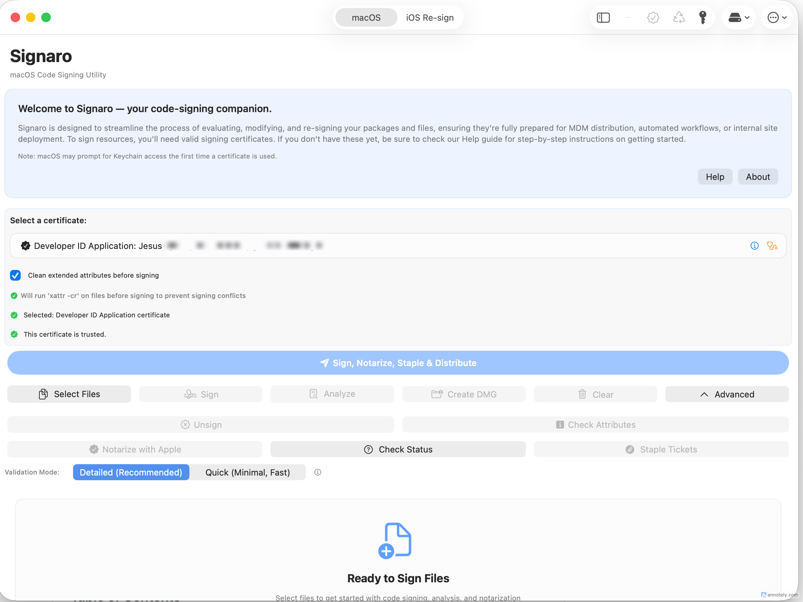
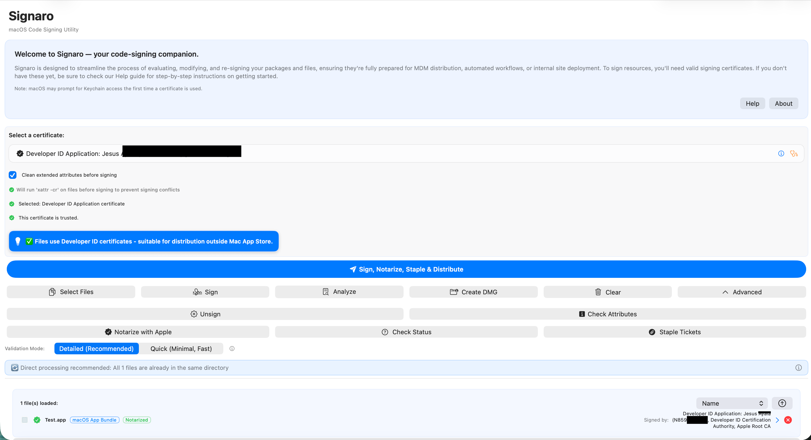
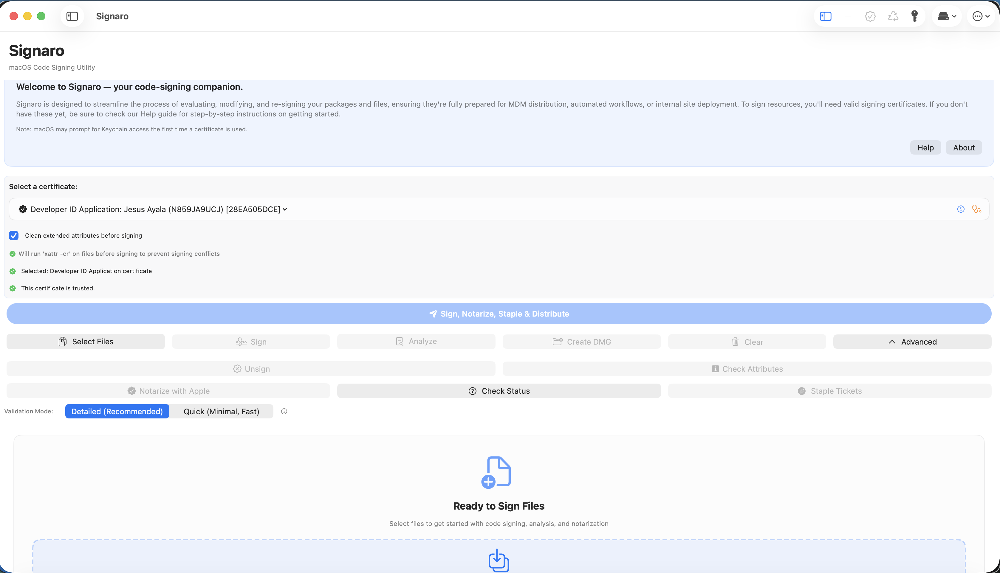
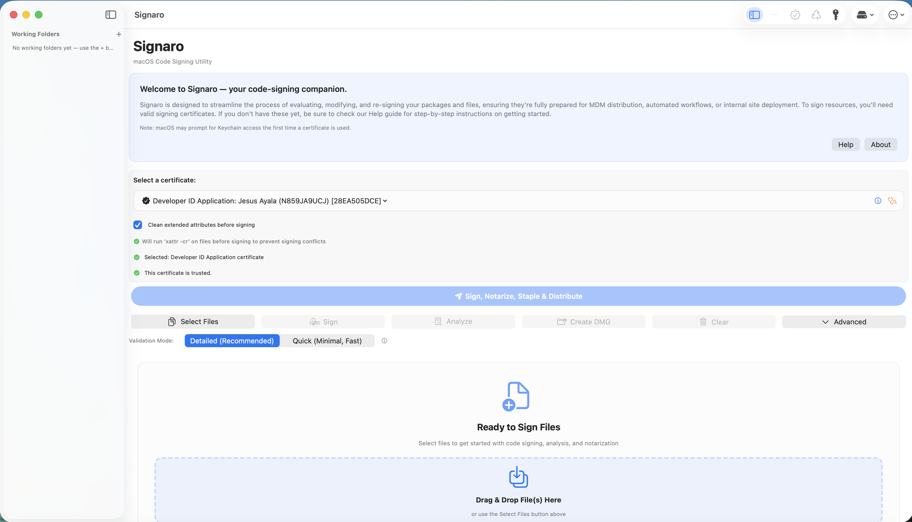

# Signaro: Advanced macOS Code Signing & Notarization Utility

<div align="center">
  
</div>

Signaro is a professional-grade, privacy-first macOS application for code signing, notarization, stapling, and distribution of `.app`, `.pkg`, `.dmg`, and `.mobileconfig` files. Built with SwiftUI and a strict MVVM architecture, it shares a single operations layer between the GUI and a native companion CLI, so every guarantee that holds in the app holds in automation as well. All processing is local; no credentials, file contents, or metadata leave the device except as required by Apple's notarization service.

**Current version: 5.0 Build 1.4 (2026-04-27)**

## Table of Contents

- [What's New](#whats-new-in-version-50-build-14)
- [Core Features](#core-features)
  - [Code Signing](#code-signing)
  - [Notarization](#notarization)
  - [DMG Creation and Customization](#dmg-creation-and-customization)
  - [Distribution Workflows](#distribution-workflows)
  - [Certificate Management](#certificate-management)
- [Command-Line Interface](#command-line-interface)
  - [CLI Commands](#commands)
  - [End-to-End Example (Profile-Based)](#end-to-end-example-profile-based)
- [Notarization Credential Modes](#notarization-credential-modes)
- [System Requirements](#system-requirements)
- [Troubleshooting](#troubleshooting)
- [Architecture Overview](#architecture-overview)
- [Version Information](#version-information)

---

## What's New in Version 5.0 Build 1.4

CLI parity completion — four GUI-only features now have full CLI equivalents, and the matching GUI wiring gaps are closed.

- **New: `folder sign <dir>`.** Sign all signable files in a directory. Auto-routes each file to the correct certificate class; supports `--recursive`, `--dry-run`, `--identity <name>`, and `--clean-attributes`. JSON output reports per-file status and a summary count.
- **New: `history list`.** Browse the local submission history from the command line. Filter by operation type (`--operation <type>`) and cap result size (`--limit N`). JSON output surfaces file path, operation, success flag, timestamp, processing time, and Apple response.
- **Updated: `identities list` expiry classification.** Every identity now includes `expiryStatus`, `expiresInDays`, and `expiresAt` fields in JSON output. Human-readable output appends `[expires in N days — STATUS]` after each name.
- **Fixed: Certificate expiry notifications now actually fire.** `notifyExpiringCertificates` is wired into the daily certificate check, delivering a `UNUserNotification` once per certificate per day at warning/imminent/expired thresholds. The Notifications preference toggle now correctly controls this via `Signaro_CertExpiryNotificationsEnabled`.
- **Fixed: Distribution runs now appear in Submission History.** `logDistributionRun(...)` is called at both success and failure exit points in the App and PKG distribution workflows. App and PKG distribution events are now browsable in the History sheet alongside signing and notarization entries.
- **Fixed: Batch signing Cancel button.** The Cancel button in the batch progress row now correctly cancels the running `BatchSigningCoordinator` operation.
- **Build metadata bump.** `CURRENT_PROJECT_VERSION` is now `1.4` (`MARKETING_VERSION` remains `5.0`), and the CLI version string is now `SignaroCLI 5.0.1.4`.

> For older release notes and historical updates, please see [RELEASE_NOTES.md](RELEASE_NOTES.md).

---

## Core Features

### Code Signing



- **In-place and copy-based signing** using `codesign` with hardened-runtime entitlements (`--options=runtime`) for notarization compatibility. Supports Developer ID Application and Developer ID Installer certificate classes.
- **Split-aware signing for mixed selections.** When the file list contains both app-type (`.app`, `.dmg`) and installer-type (`.pkg`, `.mobileconfig`) files, each file is signed with the certificate class that matches its type.

| File Type | Extension | Certificate Class |
|:---|:---|:---|
| **App Bundles** | `.app` | Developer ID Application |
| **Disk Images** | `.dmg` | Developer ID Application |
| **Installers** | `.pkg` | Developer ID Installer |
| **Config Profiles** | `.mobileconfig` | Developer ID Installer |

- **Extended attributes cleaning** (`xattr -cr`) before signing, ensuring no quarantine flags or third-party metadata interferes with notarization assessment.
- **Batch signing engine with checkpoint resume (v4.8+).** `BatchSigningCoordinator` processes files sequentially, publishes per-file live progress, saves a checkpoint after each success, and pauses on failure so the run is resumable from the exact failure point at next launch.

### Notarization



- **Full Apple notarization pipeline** via `notarytool submit` + polling loop + `stapler staple`. Supports all three Apple credential modes: Apple ID + app-specific password, Keychain Profile (`notarytool store-credentials`), and App Store Connect API Key (`.p8`).
- **Notarization requirements validation.** Pre-submission static analysis checks the signed binary's hardened runtime flag, entitlement safety, code signature validity, minimum OS version, bundle structure, and `Info.plist` completeness — surfacing issues before they cause Apple to reject the submission.
- **Entitlement & Profile Inspector (v4.6+).** Side-by-side diff between the entitlements embedded in a signed `.app` and any `.mobileprovision` profile, with orange highlighting on mismatches and risky-entitlement advisory text.

### DMG Creation and Customization

Professional disk image creation with full Finder layout customization via a mount-customize-convert pipeline (`hdiutil create -type UDIF` → R/W mount → Finder AppleScript layout → `hdiutil convert`).


- **Volume icon** (`.icns`): written to `<mount>/.VolumeIcon.icns`; `kHasCustomIcon` set via the `com.apple.FinderInfo` xattr.
- **Background image**: staged to `<mount>/.background/` and referenced via Finder AppleScript `set background picture of opts`.
- **Window geometry**: bounds, icon size (16–128 px), text size (10–16 pt), and per-file icon positions via AppleScript `set position of item`.
- **Encryption**: AES-128 and AES-256, with password piped via stdin to avoid shell-history exposure.
- **Segmentation**: `hdiutil convert -segmentSize` for split DMG sets.
- **Inline live preview**: Drag-to-position editing of icon placements with grid overlay, rulers, snap-to-guides, and auto-expand when icons are dragged beyond the current window bounds. Persistent per-surface presentation preferences via `@AppStorage`. A Preferences action resets presentation defaults for all three DMG surfaces simultaneously.
- **All three DMG surfaces at full parity (v5.0+).** App Distribution workflow dialog, PKG Distribution workflow dialog, and the standalone Create DMG dialog all expose the same inline preview and layout controls. No separate sheet.

### Distribution Workflows


- **App Distribution Workflow**: sign → notarize → staple → create DMG → sign DMG → notarize DMG → staple DMG. Full step-by-step progress with per-step result detail. The workflow supports `skipNotarizeAndStaple` for offline or pre-notarized scenarios, and `cleanExtendedAttributes` for files that carry quarantine or third-party xattrs.
- **PKG Distribution Workflow**: sign `.pkg` with `productsign` → notarize → staple → optionally create a distribution DMG → sign DMG → notarize DMG → staple DMG. The DMG created for a PKG uses the signed `.pkg` path as its single source, with all advanced layout options available.
- **Distribute All with per-file DMG customization (v5.0+).** `BatchDistributionCoordinator` fans out through the full file list, routing each file to the appropriate workflow (`AppDistributionService` or `PkgDistributionService`) with its own `DMGFileSettings`. Checkpoint/resume mirrors the batch signing engine.
- **Workflow checkpoint resume (v4.0+).** `WorkflowCheckpointStore` persists completed step IDs and execution context (credential snapshot, output paths) after every step. At next launch, `PendingWorkflowCheckpointsBanner` appears with a Resume button that restarts from the last completed step without re-executing already-finished work.

### Certificate Management

- **Workflow-aware auto-select (v4.7+).** Distribution dialog openings trigger `bestIdentity(for:)`, which filters identities by workflow type, excludes expired certificates (but not expiring-imminently ones), and prefers the identity last used for that specific workflow.
- **Per-workflow identity history.** App distribution and PKG distribution each maintain an independent last-used identity key, preventing cross-workflow history pollution.
- **Certificate Status Pill.** The selected Developer ID identity displays a days-until-expiry pill with escalating color: neutral ≥ 90 days; advisory 30–89; warning 7–29; error < 7 or expired.
- **Expiry monitoring and notifications.** `CertificateLifecycleMonitor` evaluates every discovered Developer ID identity on launch and on a daily schedule. Approaching-expiry conditions post macOS User Notifications (permission requested on first launch) and surface inline banners in the distribution dialogs.

### Working Folders



- **Named project folders** that group related files together for batch operations. Persistent across launches via `WorkingFolderManager`.
- **Sign All (v4.8+).** Signs every unsigned file in the folder, routing each to the correct certificate class automatically. Available in the GUI (folder manager) and CLI via `folder sign <dir>`. Spinner feedback during signing; status pills update in place after completion.
- **Sidebar integration.** When Working Folders mode is active, the main view adopts a two-column layout with folders in the leading sidebar. A direct toolbar button (v5.0+) toggles the sidebar without navigating to the overflow menu.

### Submission History & Analytics

- **Submission History Browser (v4.6+).** Structured, searchable record of every operation, browsable from the Submission Log window or via `history list` in the CLI. Filter by operation type, search by filename or UUID, toggle failures-only, copy request IDs to the clipboard.
- **Distribution Analytics.** On-device metrics store (`DistributionMetricsStore`) backed by `SubmissionLogger`. Aggregates submission counts, notarization durations, and failure classes. Exportable as CSV or JSON from the Analytics tab in Preferences. Strictly local — no data leaves the device.
- **Retry Policy.** Bounded exponential backoff with jitter around `notarytool submit`, with classification of retryable (5xx, DNS, timeout) versus fatal (4xx, authentication) conditions. Stapler error 65 is retried.

---

## Command-Line Interface

`SignaroCLI` is a native macOS executable built from the same Xcode project as the GUI application. It shares `CodeSigningOperations`, `NotarizationOperations`, `DMGCreationOperations`, `AppDistributionWorkflow`, and `PkgDistributionWorkflow` directly — no separate implementation, no shell-script wrappers. All commands are non-interactive by default and suitable for CI and automated build pipelines.

### Build

```bash
xcodebuild build \
  -project Signaro.xcodeproj \
  -scheme SignaroCLI \
  -destination 'platform=macOS'
```

Verify the build:

```bash
SignaroCLI --version    # → SignaroCLI 5.0.1.4
SignaroCLI --help
```

<details>
<summary>Click to view <code>SignaroCLI --help</code> output</summary>

```text
OVERVIEW: Signaro Command-Line Interface (v5.0.1.0)
Advanced macOS Code Signing, Notarization, and Distribution.

USAGE: SignaroCLI <command> [options]

COMMANDS:
  identities list      List signing identities with optional --show-all and --json.
  analyze <paths>     Report signature and notarization status. Use --smart for advice.
  validate <paths>    Pre-submission readiness check. Use --mode quick for CI.
  sign <paths>        Sign files in place. Use --identity-sha1/--identity-name for homogeneous selections. For mixed .app/.pkg batches use --app-identity-* and --pkg-identity-* to supply the correct Developer ID Application and Developer ID Installer certificates separately.
  unsign <paths>      Remove existing code signatures.
  staple <paths>      Attach notarization tickets to files.
  staple --uuid <id>  Poll for a known UUID, then staple the given file when Accepted.
  notarize submit     Submit a file to Apple's notarization service.
  notarize wait       Poll for a notarization verdict.
  notarize log        Fetch the notarization processing log.
  dmg create          Create professional DMGs with custom layouts, live preview, and auto-expanding bounds.
  distribute app      End-to-end workflow for homogeneous .app selections.
  distribute pkg      End-to-end workflow for homogeneous .pkg/.mobileconfig selections.
  credentials test    Verify notarization credentials without submitting.
  xcode-phase <proj>  Generate a Run Script Build Phase for an Xcode project.

EXAMPLES:
  # List all identities with expiration dates in JSON
  SignaroCLI identities list --show-all --json

  # Perform a quick CI validation check
  SignaroCLI validate MyApp.app --mode quick

  # Sign and create a professional DMG with background, icon, and live preview
  SignaroCLI dmg create --source MyApp.app --output Release.dmg \
    --volume-name "My Product" --background Bg.png --volume-icon Product.icns \
    --applications-alias --window-width 600 --window-height 400

  # Full automated app distribution (Sign -> Notarize -> Staple -> DMG)
  SignaroCLI distribute app --app MyApp.app --identity-name "Developer ID" \
    --keychain-profile "MyProfile" --output-dir ~/Desktop

  # Sign a homogeneous .app selection
  SignaroCLI sign MyApp.app --identity-name "Developer ID Application: Acme" --clean-attributes

  # Sign a mixed .app + .pkg selection with per-type certificates
  SignaroCLI sign MyApp.app MyInstaller.pkg \
    --app-identity-name "Developer ID Application: Acme" \
    --pkg-identity-name "Developer ID Installer: Acme" \
    --clean-attributes

GLOBAL OPTIONS:
  --json              Emit single JSON object to stdout.
  --help, -h          Show this help information.
  --version           Show version information.

CREDENTIAL OPTIONS (Notarization):
  --apple-id <id> --team-id <id> --password <pw>     Direct Apple ID auth.
  --keychain-profile <name>                           Auth via stored notarytool profile.
  --key-id <id> --issuer-id <id> --key-path <path>    Auth via ASC API Key (.p8).

DMG CUSTOMIZATION OPTIONS:
  --background <path>      Finder window background image (PNG/TIFF/JPG).
  --volume-icon <path>     Custom .icns for the mounted volume icon.
  --volume-name <name>     Custom name for the mounted volume.
  --icon-size <points>     Icon size in DMG window (default 80).
  --text-size <points>     Label text size (default 12).
  --window-width <n>       Finder window width.
  --window-height <n>      Finder window height.
  --icon-x <n>            X position of the source file icon in the DMG window.
  --icon-y <n>            Y position of the source file icon in the DMG window.
  --applications-alias     Include /Applications symlink in DMG (app workflows).
  --format <fmt>           Output format (compressed, highly-compressed, etc).
  --filesystem <fs>        Internal filesystem (APFS or HFS+).

Bug Reports: Visit https://github.com/hov172/Signaro
Documentation: Refer to README.md in the project root.
```
</details>

The embedded variant (CLI binary inside `Signaro.app/Contents/Helpers/`) is built with the `Signaro (Embedded CLI)` scheme using the `Release-Embedded` configuration.

---

### Global Flags

| Flag | Description |
|------|-------------|
| `--json` | Emit a single structured JSON object to `stdout` instead of human-readable text. All commands support this flag. |
| `--help`, `-h` | Print usage with examples and exit 0. |
| `--version` | Print `SignaroCLI 5.0.1.4` and exit 0. |

---

### Commands

| Command | Purpose | Example |
|:---|:---|:---|
| `analyze` | Check signature, notarization, & entitlements | `SignaroCLI analyze MyApp.app --smart` |
| `validate` | Pre-submission readiness check | `SignaroCLI validate MyApp.app --mode quick` |
| `sign` | Sign one or more files (split-identity aware) | `SignaroCLI sign MyApp.app --identity-name "..."` |
| `unsign` | Remove existing code signatures | `SignaroCLI unsign MyApp.app` |
| `folder sign` | Sign all signable files in a directory | `SignaroCLI folder sign ./build --recursive` |
| `notarize` | Submit, wait for, or log notarization | `SignaroCLI notarize submit MyApp.zip --wait` |
| `staple` | Attach notarization ticket to files | `SignaroCLI staple MyApp.app` |
| `dmg create` | Create customized disk images | `SignaroCLI dmg create --source App.app --icon-size 96` |
| `distribute` | Full E2E pipeline (Sign → Notarize → DMG) | `SignaroCLI distribute app --app MyApp.app` |
| `identities list` | List Developer ID identities with expiry status | `SignaroCLI identities list --json` |
| `credentials test` | Validate notarization credentials | `SignaroCLI credentials test --keychain-profile "..."` |
| `history list` | Browse local submission history | `SignaroCLI history list --limit 20` |
| `xcode-phase` | Generate Xcode Build Phase script | `SignaroCLI xcode-phase MyApp.xcodeproj` |

#### `analyze <path> [<path> ...]`

Report the code signature status of one or more files. Evaluates notarization state, signature validity, certificate expiry, and hardened-runtime flags. Supports `.app`, `.dmg`, `.pkg`, and `.mobileconfig`.

```bash
SignaroCLI analyze MyApp.app --smart
SignaroCLI analyze MyApp.app --json
SignaroCLI analyze MyApp.app MyInstaller.pkg --smart --json
```

#### `validate <path> [<path> ...]`

Run a pre-submission notarization-readiness check. Exits `65` if any file fails validation. Pass `--mode quick` for a fast preflight suitable for CI gatekeeping.

```bash
SignaroCLI validate MyApp.app --identity-sha1 ABC123 --json
SignaroCLI validate MyApp.app --mode quick
SignaroCLI validate MyApp.app MyInstaller.pkg --mode quick --json
```

#### `sign <path> [<path> ...]`

Sign one or more files. When the selection mixes `.app`/`.dmg` and `.pkg`/`.mobileconfig` files, each file is signed with the certificate class that matches its type. Pass `--clean-attributes` to strip extended attributes before signing.

```bash
SignaroCLI sign MyApp.app --identity-name "Developer ID Application: Acme (TEAMID)"
SignaroCLI sign MyApp.app MyInstaller.pkg \
  --app-identity-name "Developer ID Application: Acme (TEAMID)" \
  --pkg-identity-name "Developer ID Installer: Acme (TEAMID)" \
  --clean-attributes
```

#### `unsign <path> [<path> ...]`

Remove the code signature from one or more files. This is useful when you need to re-sign a bundle with a different identity and want to ensure a clean state.

```bash
SignaroCLI unsign MyApp.app
SignaroCLI unsign MyApp.app MyFramework.framework --json
```

#### `staple <path> [<path> ...]`

Attach a notarization ticket to one or more previously notarized files.

```bash
SignaroCLI staple MyApp.app MyInstaller.pkg
SignaroCLI staple MyApp.app --json
```

**Deferred stapling by UUID (v4.6+):** Polls a known notarization submission UUID until Accepted, then staples. Exits `65` on rejection; `69` on credential or service failure; `64` on malformed UUID.

```bash
SignaroCLI staple --uuid <request-id> MyApp.app --keychain-profile MyProfile
SignaroCLI staple --uuid <request-id> MyInstaller.pkg --keychain-profile YourprofileName --timeout 20 --poll-interval 20
```

#### `xcode-phase <path.xcodeproj>` (v4.6+)

Read an Xcode project's active build settings via `xcodebuild -showBuildSettings` and emit a ready-to-paste Run Script Build Phase that calls `signaro distribute app` with the correct `PRODUCT_NAME`, `DEVELOPMENT_TEAM`, `CODE_SIGN_IDENTITY`, and `PRODUCT_BUNDLE_IDENTIFIER` values. Pass `--json` to receive `productName`, `teamID`, `identity`, and `bundleID` as structured output.

```bash
SignaroCLI xcode-phase MyApp.xcodeproj
SignaroCLI xcode-phase MyApp.xcodeproj --json
```

#### `notarize submit <path>`

Submit a file to Apple's notarization service and print the request ID. Supports Apple ID + app-specific password, Keychain Profile, and App Store Connect API Key credential modes. Pass `--wait` to block until Apple returns a verdict.

```bash
SignaroCLI notarize submit MyApp.zip --keychain-profile MyProfile --wait
SignaroCLI notarize submit MyApp.app --keychain-profile YourprofileName --wait
SignaroCLI notarize submit MyApp.zip \
  --key-id KEYID \
  --issuer-id ISSUERID \
  --key-path ~/.private_keys/AuthKey_KEYID.p8
```

#### `notarize wait <request-id>`

Poll a previously submitted notarization request ID and exit when Apple returns a verdict. Exits `65` on rejection.

```bash
SignaroCLI notarize wait <request-id> --keychain-profile MyProfile
SignaroCLI notarize wait <request-id> --keychain-profile YourprofileName --timeout 20 --poll-interval 20
```

#### `notarize log <request-id>`

Retrieve Apple's notarization log for a completed submission. Useful for diagnosing rejection reasons.

```bash
SignaroCLI notarize log <request-id> --keychain-profile MyProfile
SignaroCLI notarize log <request-id> --keychain-profile YourprofileName --json
```

#### `dmg create`

Create a compressed DMG from a source file or directory. Supports the full advanced customization pipeline: background image, volume icon, window size, icon positions, encryption, and segmentation.

```bash
SignaroCLI dmg create \
  --source MyApp.app \
  --output ~/Desktop/MyApp.dmg \
  --volume-name "My App 2.0" \
  --background Resources/background.png \
  --volume-icon Resources/AppVolume.icns \
  --icon-size 96 \
  --text-size 12 \
  --icon-x 180 \
  --icon-y 170 \
  --window-width 560 \
  --window-height 380
```

**Advanced Creation Variants:**

```bash
# 1) Create a blank 500MB APFS disk image
SignaroCLI dmg create --blank --size 500m --volume-name "Scratch" --output scratch.dmg

# 2) Create a DMG from multiple files/folders
SignaroCLI dmg create --multiple --output collection.dmg \
  ~/Desktop/Notes.txt \
  ~/Documents/Project_A \
  --volume-name "Resources"

# 3) Create a segmented DMG (e.g. for split downloads)
SignaroCLI dmg create --segmented --source BigApp.app --segment-size 1g --output BigApp.dmg

# 4) Create an encrypted AES-256 DMG
SignaroCLI dmg create --encrypt --password "secret123" --source App.app --output safe.dmg
```

#### `identities list`

List all available Developer ID certificates. Includes human-readable expiry warnings and status pills. Use `--json` for structured metadata including SHA-1, Team ID, and serial numbers.

```bash
SignaroCLI identities list
SignaroCLI identities list --show-all --json
```

#### `folder sign <dir>` (v5.0.1.4+)

Sign all signable files in a directory. Files are auto-routed to the correct certificate class by extension. Supports recursive traversal (default), dry-run mode, explicit identity override, and extended-attributes cleaning.

```bash
SignaroCLI folder sign ./build \
  --recursive \
  --app-identity-name "Developer ID Application: Acme (TEAMID)" \
  --pkg-identity-name "Developer ID Installer: Acme (TEAMID)" \
  --clean-attributes

SignaroCLI folder sign ./artifacts --dry-run --json
```

#### `history list` (v5.0.1.4+)

Browse the local submission history captured by `SubmissionLogger`. Returns entries in reverse-chronological order. Use the request ID from a past notarization record to feed directly into `notarize log` or `staple --uuid`.

```bash
SignaroCLI history list
SignaroCLI history list --limit 50 --json
SignaroCLI history list --operation APP_DISTRIBUTION --json
```

Available `--operation` values: `SIGNING`, `NOTARIZATION`, `STAPLING`, `APP_DISTRIBUTION`, `PKG_DISTRIBUTION`, `WORKING_FOLDER`.

#### `credentials test`

Validate your notarization credentials against Apple's requirements without performing a submission. Supports Keychain Profiles, API Keys, and Apple ID modes.

```bash
SignaroCLI credentials test --keychain-profile MyProfile
SignaroCLI credentials test \
  --key-id KEYID \
  --issuer-id ISSUERID \
  --key-path ~/.private_keys/AuthKey_KEYID.p8
```

#### `distribute app`

Full App Distribution workflow: sign → notarize → staple → create DMG → sign DMG → notarize DMG → staple DMG. The input must be an `.app` bundle. Pass `--skip-notarize` to produce a signed, un-notarized DMG (useful for offline development workflows).

```bash
SignaroCLI distribute app \
  --app MyApp.app \
  --identity-name "Developer ID Application: Acme (TEAMID)" \
  --keychain-profile YourprofileName \
  --output-dir ~/Desktop \
  --volume-name "My App Installer" \
  --background Resources/background.png \
  --volume-icon Resources/AppVolume.icns
```

```bash
SignaroCLI distribute app \
  --app MyApp.app \
  --identity-sha1 ABC123 \
  --keychain-profile MyProfile \
  --output-dir ~/Desktop \
  --skip-notarize
```

#### `distribute pkg`

Full PKG Distribution workflow: sign `.pkg` with `productsign` → notarize → staple → (optionally) create a distribution DMG containing the signed package. The input must be a `.pkg` file. Use `--create-dmg` to enable the DMG step; `--icon-x` and `--icon-y` position the PKG icon in the DMG layout.

```bash
SignaroCLI distribute pkg \
  --pkg MyInstaller.pkg \
  --identity-name "Developer ID Installer: Acme (TEAMID)" \
  --keychain-profile YourprofileName \
  --create-dmg \
  --volume-name "My Installer" \
  --background Resources/pkg-bg.png \
  --icon-x 260 \
  --icon-y 170
```

### End-to-End Example (Profile-Based)

```bash
# 1) Store credentials once
xcrun notarytool store-credentials YourprofileName \
  --apple-id you@example.com \
  --team-id TEAMID

# 2) Sign
SignaroCLI sign MyApp.app \
  --identity-name "Developer ID Application: Acme (TEAMID)" \
  --clean-attributes

# 3) Submit (non-blocking)
SignaroCLI notarize submit MyApp.app --keychain-profile YourprofileName

# 4) Wait for verdict
SignaroCLI notarize wait <request-id> --keychain-profile YourprofileName

# 5) Staple and verify
SignaroCLI staple MyApp.app
xcrun stapler validate MyApp.app
spctl --assess --type exec --verbose MyApp.app
```

---

## Notarization Credential Modes

| Mode | Input Required | Recommended For |
|:---|:---|:---|
| **App-Specific Password** | Apple ID + Password | Local development |
| **Keychain Profile** | Profile Name | Local CI / Single agents |
| **API Key (.p8)** | Key ID, Issuer ID, .p8 file | Scalable CI / Headless servers |

**Apple ID + App-Specific Password**
Generate an app-specific password at [appleid.apple.com](https://appleid.apple.com). Suitable for personal development machines. Not recommended for CI environments where the Apple ID should not be persisted.

**Keychain Profile (`notarytool store-credentials`)**
Store credentials once: `xcrun notarytool store-credentials MyProfile --apple-id you@example.com --team-id TEAMID`. Signaro references the profile name at submission time. Suitable for local development and single-machine CI agents where the login keychain is available.

**App Store Connect API Key (`.p8`)**
Create a key in App Store Connect under Users and Access → Integrations → App Store Connect API. Download the `.p8` file and provide the Key ID and Issuer ID. Suitable for CI/CD agents, headless build servers, and restricted accounts where an Apple ID should not be stored.

---

## System Requirements

- **macOS 13.5 (Ventura)** or later. Universal Binary (Apple Silicon and Intel).
- **Xcode Command Line Tools** (`xcode-select --install`). Required for `codesign`, `productsign`, `notarytool`, `stapler`, and `hdiutil`.
- **Apple Developer Account** with a valid Developer ID Application and/or Developer ID Installer certificate. Code signing and notarization require a paid developer program membership.
- **Automation permission for Finder** (macOS Security & Privacy). Requested automatically on first DMG creation with custom layout. Required for the Finder AppleScript `set position of item` calls that apply icon positions and window geometry to DMG volumes.

---

## Troubleshooting

**"Signaro would like to control Finder" prompt.**
Expected on first run of any DMG with custom layout options. Click OK. This permission allows Signaro to set icon positions and window geometry via Finder AppleScript after mounting the DMG. If you previously denied the request, re-enable it in System Settings → Privacy & Security → Automation.

**"File is already stapled."**
Handled as success in v3.5+. Re-running a workflow on a file that was previously notarized and stapled produces a clean ✅ for the staple step and continues to the next step.

**Entitlement or provisioning profile mismatch.**
Open More (···) → Entitlement Inspector… and drop both the signed `.app` and the `.mobileprovision` profile. Keys present in one but absent from the other are highlighted in orange. Common causes: entitlements declared in the profile but not added to the `.entitlements` file in Xcode, or vice versa.

**Mixed signing selections behave unexpectedly.**
Signaro signs each file with the certificate class that matches its type (`.app`/`.dmg` → Developer ID Application; `.pkg`/`.mobileconfig` → Developer ID Installer). Distribution workflows require a homogeneous selection — if you mix `.app` and `.pkg` files and then press Distribute, the preflight alert will offer to open the Working Folder Manager, where you can organize the files and run separate distribution passes.

**Notarization returns "in progress" for longer than expected.**
Apple's notarization service processing time varies. Signaro polls every 30 seconds for up to 30 attempts (15 minutes total). If the submission is still active after the timeout, the request ID is displayed so you can resume later with `SignaroCLI staple --uuid <id> <path> --keychain-profile MyProfile`.

**"No request ID available for status checking" on skip-notarize workflows.**
Fixed in 5.0 Build 1.1. Update to the latest build.

**Certificate auto-select shows no identity even though a valid certificate exists.**
If the certificate's `CertificateLifecycleStatus` evaluates to `.expiringImminently`, Signaro 5.0 Build 1.0 incorrectly excluded it from the candidate pool. Fixed in 5.0 Build 1.1. An amber banner confirms the expiring-soon state while still allowing the identity to be used.

---

## Architecture Overview

Signaro is structured around a strict separation between the operations layer (which both the GUI and CLI consume) and the presentation layer (which is GUI-only).

```
Signaro.app (SwiftUI + MVVM)          SignaroCLI (Foundation + CoreGraphics)
      │                                         │
      └──────────────┬──────────────────────────┘
                     │ Shared Operations Layer
     ┌───────────────┼────────────────────────────┐
     │               │                            │
CodeSigningOps  NotarizationOps          DMGCreationOps
ProcessRunner   AppDistributionWorkflow  PkgDistributionWorkflow
IdentityManager CertificateLifecycleMonitor  WorkflowCheckpointStore
SubmissionLogger BatchSigningCoordinator  BatchDistributionCoordinator
```

| Feature | GUI Application | Command-Line Interface |
|:---|:---:|:---:|
| **App Distribution Pipeline** | ✅ | ✅ |
| **PKG Distribution Pipeline** | ✅ | ✅ |
| **DMG Layout Customization** | ✅ (Interactive Preview) | ✅ (Flags & Scripts) |
| **Smart Entitlement Analysis** | ✅ | ✅ |
| **Batch Signing & Checkpoints** | ✅ | ✅ (`folder sign` with per-file routing) |
| **Working Folder Management** | ✅ | ✅ (`folder sign <dir>`) |
| **Submission History Browser** | ✅ | ✅ (`history list`) |
| **Expiry Notifications** | ✅ | ✅ (expiry fields in `identities list`) |

Key design constraints:
- All operations execute through `ProcessRunner`, an actor-serialized wrapper around `Process` that prevents concurrent invocations of tools that do not support it (`codesign`, `productsign`, `notarytool`).
- No shared mutable state between the GUI and CLI. Both link the same modules but each binary maintains its own log namespace and credential surface.
- `@MainActor` is applied at the ViewModel and Coordinator level. Operations are `async` functions on the operations layer — called with `await` from the actor.
- `Sendable` conformance is enforced throughout. Configuration structs and result types are value types with no shared mutable references.

---

## Version Information

| Field | Value |
|-------|-------|
| Current version | 5.0 Build 1.4 |
| Build date | 2026-04-27 |
| `MARKETING_VERSION` | 5.0 |
| `CURRENT_PROJECT_VERSION` | 1.4 |
| CLI version string | `SignaroCLI 5.0.1.4` |
| Platform | macOS 13.5+, Universal Binary |
| Architecture | SwiftUI + MVVM, shared operations layer, full CLI parity |
| Test suite | 64 tests across 10 classes in `SignaroTests` |

---
## 🌐 Connect With Me
- [GitHub](https://github.com/hov172)  
- [PowerShell Gallery](https://www.powershellgallery.com/profiles/hov172)  
- 📨 Slack: **@Hov172**  
- 🕹️ Discord: **Jay172_**  
- [LinkedIn](https://www.linkedin.com/in/jesus-a-785bb616?trk=people-guest_people_search-card)  
- 🐦 [Twitter / X (@AyalaSolutions)](https://twitter.com/AyalaSolutions)  
- <a href="https://bsky.app/profile/ayalasolutions.bsky.social"></a> [@AyalaSolutions](https://bsky.app/profile/ayalasolutions.bsky.social)  
- [](https://buymeacoffee.com/hov172)  
- 📧 *Contact via GitHub, Social accounts issues or discussions*  

---

⭐ *If you find my tools useful, consider giving them a star to support future development!*
