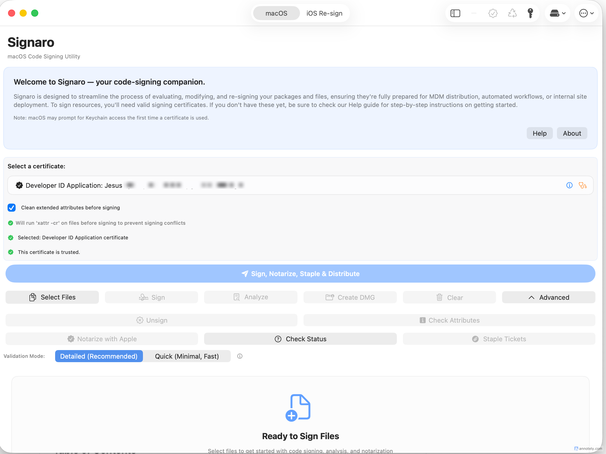
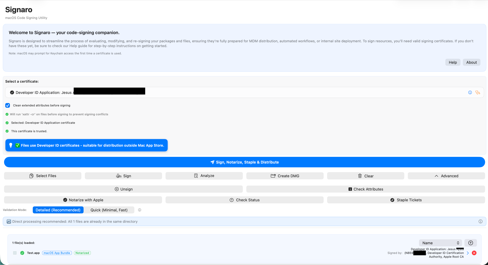
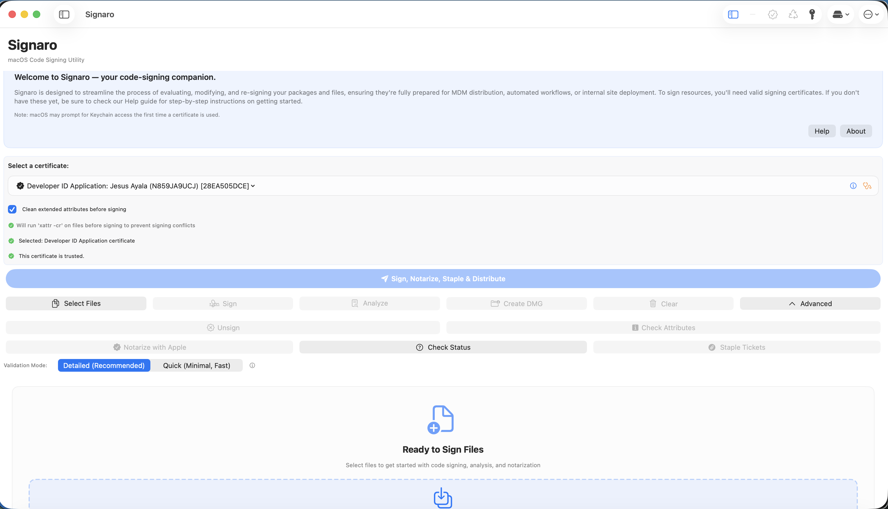
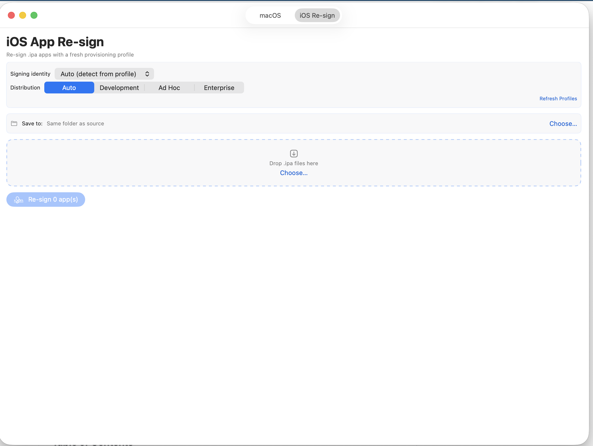
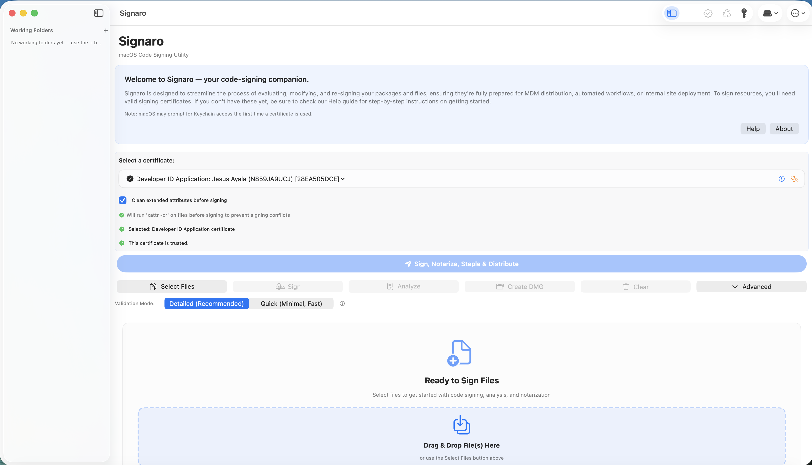

# Signaro: Advanced macOS Code Signing, Notarization & iOS Re-signing Utility

<div align="center">
  
</div>


Signaro is a professional-grade, privacy-first macOS application for code signing, notarization, stapling, and distribution of `.app`, `.pkg`, `.dmg`, and `.zip` files — plus signing of `.mobileconfig` configuration profiles, which Apple neither notarizes nor staples — plus **iOS `.ipa` re-signing** — swap in a fresh provisioning profile and re-sign every bundle inside-out, with auto-detection of the matching profile and certificate and safety guards that prevent data-losing or capability-stripping re-signs. Built with SwiftUI and a strict MVVM architecture, it shares a single operations layer between the GUI and a native companion CLI, so every guarantee that holds in the app holds in automation as well. All processing is local; no credentials, file contents, or metadata leave the device except as required by Apple's notarization service.


**Current version: 5.5 Build 1.7.21 (2026-09-25)**

**Install with Homebrew:**

```sh
brew tap hov172/signaro
brew install --cask signaro
```

Update later with `brew upgrade --cask signaro`. Prefer a direct download? See [Installation](#installation).

Already installed from the DMG or pkg? Follow [Switching to Homebrew](#switching-from-the-dmg-or-installer-to-homebrew) first.


https://github.com/user-attachments/assets/2e520203-64b5-4f04-b43e-143ff1ceed0c


## Table of Contents

- [What's New](#whats-new)
- [Core Features](#core-features)
  - [Code Signing](#code-signing)
  - [Notarization](#notarization)
  - [DMG Creation and Customization](#dmg-creation-and-customization)
  - [Distribution Workflows](#distribution-workflows)
  - [iOS App Re-signing](#ios-app-re-signing)
  - [Certificate Management](#certificate-management)
- [Command-Line Interface](#command-line-interface)
  - [CLI Commands](#commands)
  - [End-to-End Example (Profile-Based)](#end-to-end-example-profile-based)
- [Notarization Credential Modes](#notarization-credential-modes)
- [In-App Help](#in-app-help)
- [Installation](#installation)
- [System Requirements](#system-requirements)
- [Troubleshooting](#troubleshooting)
- [Architecture Overview](#architecture-overview)
- [Version Information](#version-information)

---

## What's New

**5.5 Build 1.7.21 — 2026-09-25**

- **iOS re-sign guards are stricter.** An IPA whose original team cannot be proven is blocked (the team is now also read from the code signature, so App Store and TestFlight builds without an embedded profile still resolve). A codesign failure while reading the original entitlements blocks instead of passing the parity check. App Store profiles are never auto-selected; prefix wildcards such as `TEAM.com.acme.*` match; a wildcard keychain group keeps the app's existing groups under that prefix.
- **CLI fixes.** `folder sign --recursive` and `--dry-run` no longer swallow the directory argument; `folder sign` honors `--app-identity-name` / `--pkg-identity-name`; `ios resign --json` keeps stdout to one JSON object (progress goes to stderr); `--limit`, `--timeout`, `--poll-interval` are validated; `xcode-phase` no longer hangs on large projects and emits a script `distribute app` accepts.
- **`distribute app --no-dmg`** stops after sign/notarize/staple. Headless `distribute app` no longer hangs when Finder automation is unavailable; the DMG ships with a layout warning instead.
- **`history list` works.** History is persisted to `Submission_History.jsonl` and survives relaunch, in the CLI and the app.
- **Hardening.** Notarization checks no longer build shell strings from paths; the package workflow honors Cancel; already-signed apps without hardened runtime are re-signed instead of skipped; a DMG layout with duplicate placement names is a validation error instead of a crash.

Full history for every build: [RELEASE_NOTES.md](RELEASE_NOTES.md) and [GitHub Releases](https://github.com/hov172/Signaro/releases).

---

## Core Features

### Code Signing



- **In-place and copy-based signing** using `codesign` with hardened-runtime entitlements (`--options=runtime`) for notarization compatibility. Supports Developer ID Application and Developer ID Installer certificate classes.
- **Split-aware signing for mixed selections.** When the file list contains both app-type (`.app`, `.dmg`, `.mobileconfig`) and installer-type (`.pkg`) files, each file is signed with the certificate class that matches its type.

> **Why profiles use the application certificate.** A `.mobileconfig` is a CMS/PKCS#7 document, so `security cms` will sign it with any identity in the keychain — including a Developer ID Installer certificate. That is not evidence the certificate is correct. A Developer ID Installer certificate carries a *critical* Extended Key Usage limited to Apple's installer-package OID (`1.2.840.113635.100.4.13`) with no `codeSigning`, whereas Developer ID Application, Apple Distribution, and Apple Development all carry `codeSigning`. A profile signed with a Developer ID Application certificate shows as Verified on device; the Apple Development and Apple Distribution certificates sign correctly but show as Unverified unless the developer program's intermediate certificates are already installed. For production, a publicly trusted code-signing certificate from a commercial CA remains the usual choice.

| File Type | Extension | Certificate Class | Signing Tool |
|:---|:---|:---|:---|
| **App Bundles** | `.app` | Developer ID Application | `codesign` |
| **Disk Images** | `.dmg` | Developer ID Application | `codesign` |
| **Installers** | `.pkg` | Developer ID Installer | `productsign` |
| **Config Profiles** | `.mobileconfig` | Developer ID Application | `security cms` |

- **Extended attributes cleaning** (`xattr -cr`) before signing, ensuring no quarantine flags or third-party metadata interferes with notarization assessment.
- **Batch signing engine with checkpoint resume (v4.8+).** `BatchSigningCoordinator` processes files sequentially, publishes per-file live progress, saves a checkpoint after each success, and pauses on failure so the run is resumable from the exact failure point at next launch.

### Notarization



- **Full Apple notarization pipeline** via `notarytool submit` + polling loop + `stapler staple`. Supports all three Apple credential modes: Apple ID + app-specific password, Keychain Profile (`notarytool store-credentials`), and App Store Connect API Key (`.p8`).
- **Notarization requirements validation.** Pre-submission static analysis checks the signed binary's hardened runtime flag, entitlement safety, code signature validity, minimum OS version, bundle structure, and `Info.plist` completeness — surfacing issues before they cause Apple to reject the submission.
- **Entitlement & Profile Inspector (v4.6+).** Side-by-side diff between the entitlements embedded in a signed `.app` and any `.mobileprovision` profile, with orange highlighting on mismatches and risky-entitlement advisory text.

### DMG Creation and Customization

Professional disk image creation with full Finder layout customization via a mount-customize-convert pipeline (`hdiutil create -type UDIF` → R/W mount → Finder AppleScript layout → `hdiutil convert`).


- **Volume icon** (`.icns`): written to `<mount>/.VolumeIcon.icns`; `kHasCustomIcon` set via the `com.apple.FinderInfo` xattr.
- **Background image**: staged to `<mount>/.background/` and referenced via Finder AppleScript `set background picture of opts`.
- **Window geometry**: bounds, icon size (16–128 px), text size (10–16 pt), and per-file icon positions via AppleScript `set position of item`.
- **Encryption**: AES-128 and AES-256, with password piped via stdin to avoid shell-history exposure.
- **Segmentation**: `hdiutil convert -segmentSize` for split DMG sets.
- **Inline live preview**: Drag-to-position editing of icon placements with grid overlay, rulers, snap-to-guides, and auto-expand when icons are dragged beyond the current window bounds. Persistent per-surface presentation preferences via `@AppStorage`. A Preferences action resets presentation defaults for all three DMG surfaces simultaneously.
- **Output filename follows the volume name by default.** In the standalone Create DMG dialog, leaving File Name empty makes the produced `.dmg` use the current Volume Name, with `.dmg` appended automatically. Entering a File Name still overrides this behavior.
- **All three DMG surfaces at full parity (v5.0+).** App Distribution workflow dialog, PKG Distribution workflow dialog, and the standalone Create DMG dialog all expose the same inline preview and layout controls. No separate sheet.

### Distribution Workflows


- **App Distribution Workflow**: sign → notarize → staple → create DMG → sign DMG → notarize DMG → staple DMG. Full step-by-step progress with per-step result detail. The workflow supports `skipNotarizeAndStaple` for offline or pre-notarized scenarios, and `cleanExtendedAttributes` for files that carry quarantine or third-party xattrs.
- **PKG Distribution Workflow**: sign `.pkg` with `productsign` → notarize → staple → optionally create a distribution DMG → sign DMG → notarize DMG → staple DMG. The DMG created for a PKG uses the signed `.pkg` path as its single source, with all advanced layout options available.
- **Distribute All with per-file DMG customization (v5.0+).** `BatchDistributionCoordinator` fans out through the full file list, routing each file to the appropriate workflow (`AppDistributionService` or `PkgDistributionService`) with its own `DMGFileSettings`. Checkpoint/resume mirrors the batch signing engine.
- **Workflow checkpoint resume (v4.0+).** `WorkflowCheckpointStore` persists completed step IDs and execution context (credential snapshot, output paths) after every step. At next launch, `PendingWorkflowCheckpointsBanner` appears with a Resume button that restarts from the last completed step without re-executing already-finished work.

### iOS App Re-signing



The **iOS Re-sign** tab (and the matching `ipa` CLI commands) re-signs an iOS `.ipa` with a fresh provisioning profile. It is a separate path from the macOS pipeline: `.ipa` files are always iOS and never go through notarization.

- **Add and auto-match.** Drop an `.ipa`, use **Choose…**, or press ⌘O (type-aware, switches to this tab). Signaro scans both provisioning-profile directories, picks the profile whose app ID and team match the app, and pre-selects the matching Apple Development or Distribution certificate. A Development / Ad Hoc / Enterprise selector narrows the match; **Refresh Profiles** re-scans without restarting.
- **Pre-flight analysis before anything is signed.** Each queued `.ipa` shows a predicted **Valid / Degraded / Blocked** badge with the resolved profile and identity, original team, entitlements, and an entitlement diff that lists changed, dropped, and added keys with their values. Wildcard profiles, expired profiles, and App Store profiles are called out with an explanation.
- **Inside-out signing.** Frameworks and dylibs first (code-only, no profile or entitlements), then app extensions and Watch apps, then the main app, each with a fresh `embedded.mobileprovision` and entitlements built from the profile. Every re-sign ends with `codesign --verify --deep --strict` and a read-back of the embedded entitlements.
- **Safety guards that fail closed.** A cross-team re-sign would install as a new app and lose user data, so it is blocked, including when the original team cannot be read (the team comes from the embedded profile, or from the code signature's `TeamIdentifier` for App Store and TestFlight builds). Capability parity is enforced at the value level: any entitlement the original app had must survive with the same value; gaining new ones is allowed, losing any is blocked. If codesign cannot read the original entitlements at all, the re-sign is blocked rather than checked against nothing. App Store profiles are never auto-selected because they only install through Apple's servers.
- **Per-bundle control.** App extensions and Watch apps each show their own matched-profile row. Drop a `.mobileprovision` onto any row to override that bundle's profile.
- **Device tooling.** Paste UDIDs to check coverage against the profile's device list, or ask this Mac for its connected devices. After a successful Ad Hoc, Development, or Enterprise re-sign, **Install on Device…** installs the output via `devicectl`, and **OTA Manifest…** generates the `manifest.plist` for over-the-air installation.
- **Batch handling.** Queue several `.ipa`s: analysis runs concurrently, re-signing runs sequentially and isolates failures, a summary bar reports Valid / Degraded / Failed, and **Cancel** stops cleanly after the current app. Reveal any result in Finder.

> Re-signing requires a non-sandboxed build (it spawns `codesign` and `security` and reads the profiles directory and keychain). A `codesign --verify`-clean signature is correctly signed; whether it installs depends on the profile: **Ad Hoc** and **Development** profiles carry a device list (UDIDs must be registered in the Apple Developer portal and baked into the profile), **Enterprise** profiles install on any device in the organization, and **App Store** profiles are for local signing only and require distribution via App Store Connect.

### Certificate Management

- **Workflow-aware auto-select (v4.7+).** Distribution dialog openings trigger `bestIdentity(for:)`, which filters identities by workflow type, excludes expired certificates (but not expiring-imminently ones), and prefers the identity last used for that specific workflow.
- **Per-workflow identity history.** App distribution and PKG distribution each maintain an independent last-used identity key, preventing cross-workflow history pollution.
- **Certificate Status Pill.** The selected Developer ID identity displays a days-until-expiry pill with escalating color: neutral ≥ 90 days; advisory 30–89; warning 7–29; error < 7 or expired.
- **Expiry monitoring and notifications.** `CertificateLifecycleMonitor` evaluates every discovered Developer ID identity live against the keychain on launch and on a daily schedule, and reconciles already-delivered notifications against current state so a renewed or removed certificate's banner doesn't linger.
- **Post-renewal cleanup (v5.5 Build 1.7.9+).** Once a renewed certificate's replacement is confirmed healthy (same Team ID and type, later non-expired expiry), Signaro offers a **Delete…** action for the old one — in the picker hint and in the stethoscope diagnostic's "Renewed — Safe to Clean Up" section — removing the full identity (certificate + private key) after an explicit destructive confirmation. Never reachable without a confirmed replacement, so it can't strand signing capability.

### Working Folders



- **Named project folders** that group related files together for batch operations. Persistent across launches via `WorkingFolderManager`.
- **Sign All (v4.8+).** Signs every unsigned file in the folder, routing each to the correct certificate class automatically. Available in the GUI (folder manager) and CLI via `folder sign <dir>`. Spinner feedback during signing; status pills update in place after completion.
- **Sidebar integration.** When Working Folders mode is active, the main view adopts a two-column layout with folders in the leading sidebar. A direct toolbar button (v5.0+) toggles the sidebar without navigating to the overflow menu.

### Submission History & Analytics

- **Submission History Browser (v4.6+).** Structured, searchable record of every operation, browsable from the Submission Log window or via `history list` in the CLI. Filter by operation type, search by filename or UUID, toggle failures-only, copy request IDs to the clipboard.
- **Distribution Analytics.** On-device metrics store (`DistributionMetricsStore`) backed by `SubmissionLogger`. Aggregates submission counts, notarization durations, and failure classes. Exportable as CSV or JSON from the Analytics tab in Preferences. Strictly local — no data leaves the device.
- **Retry Policy.** Bounded exponential backoff with jitter around `notarytool submit`, with classification of retryable (5xx, DNS, timeout) versus fatal (4xx, authentication) conditions. Stapler error 65 is retried.

---

## Command-Line Interface

`SignaroCLI` is a native macOS executable built from the same Xcode project as the GUI application. It shares `CodeSigningOperations`, `NotarizationOperations`, `DMGCreationOperations`, `AppDistributionWorkflow`, and `PkgDistributionWorkflow` directly — no separate implementation, no shell-script wrappers. All commands are non-interactive by default and suitable for CI and automated build pipelines.

### Build

```bash
xcodebuild build \
  -project Signaro.xcodeproj \
  -scheme SignaroCLI \
  -destination 'platform=macOS'
```

Verify the build:

```bash
SignaroCLI --version    # → SignaroCLI 5.5 Build 1.7.21
SignaroCLI --help
```

<details>
<summary>Click to view <code>SignaroCLI --help</code> output</summary>

```text
OVERVIEW: Signaro Command-Line Interface (v5.5.1.7.21)
Advanced macOS Code Signing, Notarization, and Distribution.

USAGE: SignaroCLI <command> [options]

COMMANDS:
  identities list      List signing identities. Includes expiry status fields (--json) and expiry warnings (text). Use --show-all to include untrusted identities.
                       --check-revocation  Also verify each certificate against Apple's OCSP responder (network). A revoked cert signs fine but fails at Gatekeeper/notarization.
  analyze <paths>      Report signature and notarization status. Use --smart for advice.
  validate <paths>     Pre-submission readiness check. Use --mode quick for CI.
  sign <paths>         Sign one or more files. For mixed .app/.pkg batches use --app-identity-* and --pkg-identity-*.
  unsign <paths>       Remove existing code signatures.
  staple <paths>       Attach notarization tickets to files.
  staple --uuid <id>   Poll for a known UUID, then staple the given file when Accepted.
  notarize submit      Submit a file to Apple's notarization service.
  notarize wait        Poll for a notarization verdict.
  notarize log         Fetch the notarization processing log.
  dmg create           Create professional DMGs with custom layouts, live preview, and auto-expanding bounds.
  distribute app       End-to-end workflow for .app: sign → notarize → staple → DMG. --no-dmg stops after the app.
  distribute pkg       End-to-end workflow for .pkg: sign → notarize → staple.
  folder sign <dir>    Sign all signable files in a directory. Use --recursive, --dry-run, --identity <name> or --app-/--pkg-identity-name.
  ios analyze <ipa>    Dry-run an iOS .ipa re-sign: predict Valid/Degraded/Blocked, auto-detected profile + cert, and reasons. No changes made.
                       --distribution development|adhoc|enterprise|appstore  Filter profile matching to a specific distribution type.
  ios resign <ipa>     Re-sign an iOS .ipa with a fresh profile. Auto-detects profile + cert; --identity-name/-sha1 to override, --output <path> for a single .ipa.
                       --distribution development|adhoc|enterprise|appstore  Filter profile matching to a specific distribution type.
                       --ota-url <https://…/app.ipa>  Generate manifest.plist and install.html for OTA distribution.
  ios install <ipa>    Install a (re-signed) .ipa or .app onto a device: --device <udid-or-name>. Uses devicectl (iOS 17+, Xcode 15+).
  devices list         List devices known to this Mac via devicectl, with UDID, OS, connection state, and Developer Mode status.
  devices registered   List devices registered to the team in App Store Connect (read-only ASC API; App Manager/Admin role). --udid <u1,u2> cross-checks specific UDIDs.
  history list         Browse local submission history. Use --limit N and --operation <type>.
  credentials test     Verify notarization credentials without submitting.
  xcode-phase <proj>   Generate a Run Script Build Phase for an Xcode project.

EXAMPLES:
  # List all identities with expiration dates in JSON
  SignaroCLI identities list --show-all --json

  # Perform a quick CI validation check
  SignaroCLI validate MyApp.app --mode quick

  # Sign and create a professional DMG with background, icon, and live preview
  SignaroCLI dmg create --source MyApp.app --output Release.dmg \
    --volume-name "My Product" --background Bg.png --volume-icon Product.icns \
    --applications-alias --window-width 600 --window-height 400

  # Full automated app distribution (Sign -> Notarize -> Staple -> DMG)
  SignaroCLI distribute app --app MyApp.app --identity-name "Developer ID" \
    --keychain-profile "MyProfile" --output-dir ~/Desktop

  # Submit + wait using a stored notarytool profile
  SignaroCLI notarize submit MyApp.app --keychain-profile "MyProfile" --wait

  # Deferred staple flow using request UUID
  SignaroCLI notarize wait <request-id> --keychain-profile "MyProfile"
  SignaroCLI staple --uuid <request-id> MyApp.app --keychain-profile "MyProfile"

  # Sign a homogeneous .app selection
  SignaroCLI sign MyApp.app --identity-name "Developer ID Application: Acme" --clean-attributes

  # Sign a mixed .app + .pkg selection with per-type certificates
  SignaroCLI sign MyApp.app MyInstaller.pkg \
    --app-identity-name "Developer ID Application: Acme" \
    --pkg-identity-name "Developer ID Installer: Acme" \
    --clean-attributes

  # Preview an iOS .ipa re-sign, then re-sign and generate OTA distribution files
  SignaroCLI ios analyze MyApp.ipa --distribution adhoc
  SignaroCLI ios resign MyApp.ipa --output ~/Desktop/MyApp.resigned.ipa \
    --ota-url https://example.com/apps/MyApp.resigned.ipa

GLOBAL OPTIONS:
  --json              Emit single JSON object to stdout.
  --help, -h          Show this help information.
  --version           Show version information.

CREDENTIAL OPTIONS (Notarization):
  --apple-id <id> --team-id <id> --password <pw>     Direct Apple ID auth.
  --keychain-profile <name>                           Auth via stored notarytool profile.
  --key-id <id> --issuer-id <id> --key-path <path>    Auth via ASC API Key (.p8).

DMG CUSTOMIZATION OPTIONS:
  --background <path>      Finder window background image (PNG/TIFF/JPG).
  --volume-icon <path>     Custom .icns for the mounted volume icon.
  --volume-name <name>     Custom name for the mounted volume.
  --icon-size <points>     Icon size in DMG window (default 80).
  --text-size <points>     Label text size (default 12).
  --window-width <n>       Finder window width.
  --window-height <n>      Finder window height.
  --icon-x <n>             X position of the source file icon in the DMG window.
  --icon-y <n>             Y position of the source file icon in the DMG window.
  --applications-alias     Include /Applications symlink in DMG (app workflows).
  --format <fmt>           Output format (compressed, highly-compressed, etc).
  --filesystem <fs>        Internal filesystem (APFS or HFS+).

Bug Reports: Visit https://github.com/hov172/Signaro
Documentation: Refer to README.md in the project root.
```
</details>

The embedded variant (CLI binary inside `Signaro.app/Contents/Helpers/`) is built with the `Signaro (Embedded CLI)` scheme using the `Release-Embedded` configuration.

---

### Global Flags

| Flag | Description |
|------|-------------|
| `--json` | Emit a single structured JSON object to `stdout` instead of human-readable text. All commands support this flag. |
| `--help`, `-h` | Print usage with examples and exit 0. |
| `--version` | Print `SignaroCLI 5.0.1.5.5` and exit 0. |

---

### Commands

| Command | Purpose | Example |
|:---|:---|:---|
| `analyze` | Check signature, notarization, & entitlements | `SignaroCLI analyze MyApp.app --smart` |
| `validate` | Pre-submission readiness check | `SignaroCLI validate MyApp.app --mode quick` |
| `sign` | Sign one or more files (split-identity aware) | `SignaroCLI sign MyApp.app --identity-name "..."` |
| `unsign` | Remove existing code signatures | `SignaroCLI unsign MyApp.app` |
| `ios analyze` | Dry-run an iOS `.ipa` re-sign (predict + auto-detect) | `SignaroCLI ios analyze MyApp.ipa` |
| `ios resign` | Re-sign an iOS `.ipa` with a fresh profile; optional `--ota-url` for OTA distribution files | `SignaroCLI ios resign MyApp.ipa --output My.resigned.ipa` |
| `ios install` | Install a (re-signed) `.ipa` or `.app` onto a connected device via `devicectl` | `SignaroCLI ios install My.resigned.ipa --device <udid>` |
| `devices list` | List devices paired with this Mac (UDID, OS, connection state, Developer Mode) | `SignaroCLI devices list --json` |
| `devices registered` | List the team's device registry from App Store Connect (read-only); `--udid` cross-checks specific UDIDs | `SignaroCLI devices registered --key-id K --issuer-id I --key-path k.p8` |
| `folder sign` | Sign all signable files in a directory | `SignaroCLI folder sign ./build --recursive` |
| `notarize` | Submit, wait for, or log notarization | `SignaroCLI notarize submit MyApp.zip --wait` |
| `staple` | Attach notarization ticket to files | `SignaroCLI staple MyApp.app` |
| `dmg create` | Create customized disk images | `SignaroCLI dmg create --source App.app --icon-size 96` |
| `distribute` | Full E2E pipeline (Sign → Notarize → DMG) | `SignaroCLI distribute app --app MyApp.app` |
| `identities list` | List Developer ID identities with expiry status; `--check-revocation` for OCSP verification | `SignaroCLI identities list --json` |
| `credentials test` | Validate notarization credentials | `SignaroCLI credentials test --keychain-profile "..."` |
| `history list` | Browse local submission history | `SignaroCLI history list --limit 20` |
| `xcode-phase` | Generate Xcode Build Phase script | `SignaroCLI xcode-phase MyApp.xcodeproj` |

#### `analyze <path> [<path> ...]`

Report the code signature status of one or more files. Evaluates notarization state, signature validity, certificate expiry, and hardened-runtime flags. Supports `.app`, `.dmg`, `.pkg`, and `.mobileconfig`.

```bash
SignaroCLI analyze MyApp.app --smart
SignaroCLI analyze MyApp.app --json
SignaroCLI analyze MyApp.app MyInstaller.pkg --smart --json
```

#### `validate <path> [<path> ...]`

Run a pre-submission notarization-readiness check. Exits `65` if any file fails validation. Pass `--mode quick` for a fast preflight suitable for CI gatekeeping.

```bash
SignaroCLI validate MyApp.app --identity-sha1 ABC123 --json
SignaroCLI validate MyApp.app --mode quick
SignaroCLI validate MyApp.app MyInstaller.pkg --mode quick --json
```

#### `sign <path> [<path> ...]`

Sign one or more files. When the selection mixes `.app`/`.dmg`/`.mobileconfig` and `.pkg` files, each file is signed with the certificate class that matches its type. Pass `--clean-attributes` to strip extended attributes before signing.

```bash
SignaroCLI sign MyApp.app --identity-name "Developer ID Application: Acme (TEAMID)"
SignaroCLI sign MyApp.app MyInstaller.pkg \
  --app-identity-name "Developer ID Application: Acme (TEAMID)" \
  --pkg-identity-name "Developer ID Installer: Acme (TEAMID)" \
  --clean-attributes
```

#### `unsign <path> [<path> ...]`

Remove the code signature from one or more files. This is useful when you need to re-sign a bundle with a different identity and want to ensure a clean state.

```bash
SignaroCLI unsign MyApp.app
SignaroCLI unsign MyApp.app MyFramework.framework --json
```

#### `ios analyze <ipa> [<ipa> ...]`

Read-only dry run of an iOS `.ipa` re-sign. Auto-detects the matching provisioning profile and the certificate it authorizes, then predicts **Valid / Degraded / Blocked** with the resolved profile, distribution type, identity, original team, capability-parity result, and profile/cert expiry. Never modifies anything.

Flags:
- `--distribution development|adhoc|enterprise` — constrain profile matching to a specific distribution type; auto-selects the matching cert kind (Apple Development for development, Apple Distribution for ad hoc/enterprise)
- `--identity-name` / `--identity-sha1` — override auto-detected certificate
- `--json` — machine-readable output

```bash
SignaroCLI ios analyze MyApp.ipa
SignaroCLI ios analyze MyApp.ipa --distribution adhoc
SignaroCLI ios analyze MyApp.ipa --json
```

Sample output:
```
MyApp.ipa: VALID — profile 'MyApp AdHoc' (Ad Hoc), identity 'Apple Distribution: Jane (ABCDE12345)'
  [bundle com.example.myapp, team ABCDE12345]
  profile expires 2026-12-01, in 157d
```

#### `ios resign <ipa> [<ipa> ...]`

Re-sign one or more iOS `.ipa`s with a fresh provisioning profile. Pre-analyzes each IPA first (reuses the result in the resign step to avoid a redundant unzip). Writes `<name>.resigned.ipa` next to each input; appends `-2`/`-3` if the output already exists rather than overwriting. Use `--output <path>` for a single `.ipa`. Prints `→ MyExtension.appex` per bundle signed; on failure prints the retained work-dir path for diagnosis. Honors the same guards as the GUI (inside-out signing, same-team enforcement, deny-by-default capability parity) and returns a non-zero exit code if any re-sign is blocked.

Flags:
- `--distribution development|adhoc|enterprise|appstore` — constrain profile + cert selection to a specific type
- `--identity-name` / `--identity-sha1` — override auto-detected certificate
- `--output <path>` — explicit output path (single `.ipa` only)
- `--ota-url <https://…/app.ipa>` — HTTPS URL where the re-signed IPA will be hosted. Generates `manifest.plist` and `install.html` alongside the output IPA for over-the-air distribution. The `itms-services://` install link is printed to stdout. Single IPA only (each IPA needs its own hosted URL). Applicable to Ad Hoc, Development, and Enterprise profiles.
- `--json` — machine-readable output: stdout is exactly one JSON object; progress lines (`analyzing…`, `signing…`, `→ Bundle`) go to stderr. A failed OTA manifest write fails the run.

```bash
SignaroCLI ios resign MyApp.ipa
SignaroCLI ios resign MyApp.ipa --distribution adhoc
SignaroCLI ios resign MyApp.ipa --output ~/Desktop/MyApp.resigned.ipa
SignaroCLI ios resign MyApp.ipa --identity-name "Apple Distribution: Jane (ABCDE12345)" --json
SignaroCLI ios resign MyApp.ipa \
  --output ~/Desktop/MyApp.resigned.ipa \
  --ota-url https://example.com/apps/MyApp.resigned.ipa
```

#### `ios install <ipa|app> --device <udid-or-name>`

Install a (re-signed) `.ipa` or `.app` onto a device using `devicectl` (ships with Xcode 15+; lists iOS 17+ devices paired with this Mac). A successful on-device install is the definitive proof that a re-signed IPA's profile, certificate, and entitlements all line up — `codesign --verify` alone can't prove installability. The device may be given by UDID or by name. Exits `69` with devicectl's error when the device is unreachable or rejects the app.

```bash
SignaroCLI ios resign MyApp.ipa
SignaroCLI ios install MyApp.resigned.ipa --device 00008120-000A1B2C3D4E5F60
SignaroCLI ios install MyApp.resigned.ipa --device "Jane's iPhone" --json
```

#### `devices list`

List every device known to this Mac through CoreDevice: name, model, OS version, UDID, connection state, and Developer Mode status. Useful before `ios install` and for checking UDIDs against an Ad Hoc profile without touching the portal. Devices appear here after being paired once via Xcode or Finder; `devicectl` only tracks iOS 17+ devices.

```bash
SignaroCLI devices list
SignaroCLI devices list --json
```

Sample output:
```
Jane's iPhone (iPhone 15 Pro Max · iOS 26.5) — UDID 00008120-000A1B2C3D4E5F60 — connected
```

#### `devices registered --key-id <id> --issuer-id <id> --key-path <p8>`

Read-only view of the team's device registry in App Store Connect, authenticated with the same API-key triple used for notarization. **Role caveat:** a notarization-only key (Developer role) gets a 403 here — the device registry requires **App Manager or Admin**. Signaro deliberately does not implement device registration or profile regeneration: registering a device consumes one slot of the non-refundable 100-device annual quota, and ASC profile "editing" is actually delete-and-recreate, which can break teammates and CI pipelines pinning that profile.

`--udid <u1,u2>` cross-checks specific UDIDs against the registry and tells you which fix applies:
- **Registered but not in the profile** → the profile predates the device; regenerate the profile in the developer portal.
- **Not registered** → register the device first (consumes quota), then regenerate the profile.

```bash
SignaroCLI devices registered --key-id ABC123DEFG --issuer-id 12345678-abcd-... --key-path ~/keys/AuthKey.p8
SignaroCLI devices registered --key-id ... --issuer-id ... --key-path ... \
  --udid 00008120-000A1B2C3D4E5F60 --json
```

#### `staple <path> [<path> ...]`

Attach a notarization ticket to one or more previously notarized files.

```bash
SignaroCLI staple MyApp.app MyInstaller.pkg
SignaroCLI staple MyApp.app --json
```

**Deferred stapling by UUID (v4.6+):** Polls a known notarization submission UUID until Accepted, then staples. Exits `65` on rejection; `69` on credential or service failure; `64` on malformed UUID.

```bash
SignaroCLI staple --uuid <request-id> MyApp.app --keychain-profile MyProfile
SignaroCLI staple --uuid <request-id> MyInstaller.pkg --keychain-profile YourprofileName --timeout 20 --poll-interval 20
```

#### `xcode-phase <path.xcodeproj>` (v4.6+)

Read an Xcode project's active build settings via `xcodebuild -showBuildSettings` and emit a ready-to-paste Run Script Build Phase that calls `signaro distribute app` with the correct `PRODUCT_NAME`, `DEVELOPMENT_TEAM`, `CODE_SIGN_IDENTITY`, and `PRODUCT_BUNDLE_IDENTIFIER` values. Pass `--json` to receive `productName`, `teamID`, `identity`, and `bundleID` as structured output.

```bash
SignaroCLI xcode-phase MyApp.xcodeproj
SignaroCLI xcode-phase MyApp.xcodeproj --json
```

#### `notarize submit <path>`

Submit a file to Apple's notarization service and print the request ID. Supports Apple ID + app-specific password, Keychain Profile, and App Store Connect API Key credential modes. Pass `--wait` to block until Apple returns a verdict.

```bash
SignaroCLI notarize submit MyApp.zip --keychain-profile MyProfile --wait
SignaroCLI notarize submit MyApp.app --keychain-profile YourprofileName --wait
SignaroCLI notarize submit MyApp.zip \
  --key-id KEYID \
  --issuer-id ISSUERID \
  --key-path ~/.private_keys/AuthKey_KEYID.p8
```

#### `notarize wait <request-id>`

Poll a previously submitted notarization request ID and exit when Apple returns a verdict. Exits `65` on rejection. `--timeout` (minutes) and `--poll-interval` (seconds) must be whole numbers ≥ 1; anything else is a usage error (exit 64).

```bash
SignaroCLI notarize wait <request-id> --keychain-profile MyProfile
SignaroCLI notarize wait <request-id> --keychain-profile YourprofileName --timeout 20 --poll-interval 20
```

#### `notarize log <request-id>`

Retrieve Apple's notarization log for a completed submission. Useful for diagnosing rejection reasons.

```bash
SignaroCLI notarize log <request-id> --keychain-profile MyProfile
SignaroCLI notarize log <request-id> --keychain-profile YourprofileName --json
```

#### `dmg create`

Create a compressed DMG from a source file or directory. Supports the full advanced customization pipeline: background image, volume icon, window size, icon positions, encryption, and segmentation.

```bash
SignaroCLI dmg create \
  --source MyApp.app \
  --output ~/Desktop/MyApp.dmg \
  --volume-name "My App 2.0" \
  --background Resources/background.png \
  --volume-icon Resources/AppVolume.icns \
  --icon-size 96 \
  --text-size 12 \
  --icon-x 180 \
  --icon-y 170 \
  --window-width 560 \
  --window-height 380
```

**Advanced Creation Variants:**

```bash
# 1) Create a blank 500MB APFS disk image
SignaroCLI dmg create --blank --size 500m --volume-name "Scratch" --output scratch.dmg

# 2) Create a DMG from multiple files/folders
SignaroCLI dmg create --multiple --output collection.dmg \
  ~/Desktop/Notes.txt \
  ~/Documents/Project_A \
  --volume-name "Resources"

# 3) Create a segmented DMG (e.g. for split downloads)
SignaroCLI dmg create --segmented --source BigApp.app --segment-size 1g --output BigApp.dmg

# 4) Create an encrypted AES-256 DMG
SignaroCLI dmg create --encrypt --password "secret123" --source App.app --output safe.dmg
```

#### `identities list`

List all available Developer ID certificates. Includes human-readable expiry warnings and status pills. Use `--json` for structured metadata including SHA-1, Team ID, and serial numbers.

`--check-revocation` additionally verifies each certificate against Apple's OCSP responder. This catches the nastiest signing failure: a **revoked** certificate has valid dates and signs cleanly with `codesign`, but the output is rejected later at Gatekeeper or notarization with an unrelated-looking error. The check is soft-fail — only an affirmative "revoked" answer from the trust engine is reported as revoked; network trouble is reported as "unconfirmed", never as a false alarm. It is a network operation, hence opt-in.

```bash
SignaroCLI identities list
SignaroCLI identities list --show-all --json
SignaroCLI identities list --check-revocation
```

Sample `--check-revocation` output:
```
✅ Developer ID Application: Jane Doe (TEAMID1234) [C4F8…A794] [revocation: not revoked (OCSP confirmed)]
```

#### `folder sign <dir>` (v5.0.1.4+)

Sign all signable files in a directory. Files are auto-routed to the correct certificate class by extension: `.pkg` uses the installer identity, everything else the application identity. Identity resolution per class: `--identity <name-or-sha1>` forces one identity for every file; otherwise `--app-identity-name` / `--app-identity-sha1` and `--pkg-identity-name` / `--pkg-identity-sha1` apply; otherwise the class's identity is used only if the keychain holds exactly one, and files are skipped with a hint when several qualify. `--recursive` descends into subfolders (bundles are not entered), `--dry-run` reports what would be signed, `--clean-attributes` strips extended attributes first. A signing failure exits `69`.

```bash
SignaroCLI folder sign ./build \
  --recursive \
  --app-identity-name "Developer ID Application: Acme (TEAMID)" \
  --pkg-identity-name "Developer ID Installer: Acme (TEAMID)" \
  --clean-attributes

SignaroCLI folder sign ./artifacts --dry-run --json
```

#### `history list` (v5.0.1.4+)

Browse the local submission history captured by `SubmissionLogger`. Entries are persisted to `~/Documents/Signaro Logs/Submission_History.jsonl` (one JSON line per operation, newest 500 kept), so runs from the app and from earlier CLI invocations are all visible. Returns entries in reverse-chronological order. Use the request ID from a past notarization record to feed directly into `notarize log` or `staple --uuid`. `--limit` must be a whole number ≥ 1.

```bash
SignaroCLI history list
SignaroCLI history list --limit 50 --json
SignaroCLI history list --operation distribute-app --json
```

`--operation` accepts the short names `sign`, `notarize`, `staple`, `distribute-app`, `distribute-pkg`, or any raw operation name such as `CODE_SIGNING`, `APP_DISTRIBUTION`, `PKG_DISTRIBUTION`, `WORKING_FOLDER`.

#### `credentials test`

Validate your notarization credentials against Apple's requirements without performing a submission. Supports Keychain Profiles, API Keys, and Apple ID modes.

```bash
SignaroCLI credentials test --keychain-profile MyProfile
SignaroCLI credentials test \
  --key-id KEYID \
  --issuer-id ISSUERID \
  --key-path ~/.private_keys/AuthKey_KEYID.p8
```

#### `distribute app`

Full App Distribution workflow: sign → notarize → staple → create DMG → sign DMG → notarize DMG → staple DMG. The input must be an `.app` bundle. Pass `--skip-notarize-and-staple` to produce a signed, un-notarized DMG (useful for offline development workflows). Pass `--no-dmg` to stop after the app is signed, notarized and stapled; no output directory is needed then. An app that is already signed by the selected team with a secure timestamp **and** the hardened runtime skips the signing step; anything less is re-signed.

Headless use (CI, SSH): Finder icon layout is applied through `osascript` with a 60-second limit. Without Finder automation permission the DMG is still created and signed and the result carries a "Finder layout warning".

```bash
SignaroCLI distribute app \
  --app MyApp.app \
  --identity-name "Developer ID Application: Acme (TEAMID)" \
  --keychain-profile YourprofileName \
  --output-dir ~/Desktop \
  --volume-name "My App Installer" \
  --background Resources/background.png \
  --volume-icon Resources/AppVolume.icns
```

```bash
SignaroCLI distribute app \
  --app MyApp.app \
  --identity-sha1 ABC123 \
  --keychain-profile MyProfile \
  --output-dir ~/Desktop \
  --skip-notarize-and-staple

SignaroCLI distribute app --app MyApp.app --identity-name "Developer ID Application: Acme" \
  --keychain-profile MyProfile --no-dmg
```

#### `distribute pkg`

Full PKG Distribution workflow: sign `.pkg` with `productsign` → notarize → staple → (optionally) create a distribution DMG containing the signed package. The input must be a `.pkg` file. Use `--create-dmg` to enable the DMG step; `--icon-x` and `--icon-y` position the PKG icon in the DMG layout.

```bash
SignaroCLI distribute pkg \
  --pkg MyInstaller.pkg \
  --identity-name "Developer ID Installer: Acme (TEAMID)" \
  --keychain-profile YourprofileName \
  --create-dmg \
  --volume-name "My Installer" \
  --background Resources/pkg-bg.png \
  --icon-x 260 \
  --icon-y 170
```

### End-to-End Example (Profile-Based)

```bash
# 1) Store credentials once
xcrun notarytool store-credentials YourprofileName \
  --apple-id you@example.com \
  --team-id TEAMID

# 2) Sign
SignaroCLI sign MyApp.app \
  --identity-name "Developer ID Application: Acme (TEAMID)" \
  --clean-attributes

# 3) Submit (non-blocking)
SignaroCLI notarize submit MyApp.app --keychain-profile YourprofileName

# 4) Wait for verdict
SignaroCLI notarize wait <request-id> --keychain-profile YourprofileName

# 5) Staple and verify
SignaroCLI staple MyApp.app
xcrun stapler validate MyApp.app
spctl --assess --type exec --verbose MyApp.app
```

---

## Notarization Credential Modes

| Mode | Input Required | Recommended For |
|:---|:---|:---|
| **App-Specific Password** | Apple ID + Password | Local development |
| **Keychain Profile** | Profile Name | Local CI / Single agents |
| **API Key (.p8)** | Key ID, Issuer ID, .p8 file | Scalable CI / Headless servers |

**Apple ID + App-Specific Password**
Generate an app-specific password at [appleid.apple.com](https://appleid.apple.com). Suitable for personal development machines. Not recommended for CI environments where the Apple ID should not be persisted.

**Keychain Profile (`notarytool store-credentials`)**
Store credentials once: `xcrun notarytool store-credentials MyProfile --apple-id you@example.com --team-id TEAMID`. Signaro references the profile name at submission time. Suitable for local development and single-machine CI agents where the login keychain is available.

**App Store Connect API Key (`.p8`)**
Create a key in App Store Connect under Users and Access → Integrations → App Store Connect API. Download the `.p8` file and provide the Key ID and Issuer ID. Suitable for CI/CD agents, headless build servers, and restricted accounts where an Apple ID should not be stored.

---

## In-App Help

Open the Help sheet at any time from the **Help** menu or the **?** button in the toolbar. It covers every major feature with enough detail to get started without leaving the app.

**macOS Code Signing & Notarization**
- Smart Certificate Selection — how Signaro filters and recommends certificates
- Intelligent Recommendations — per-file certificate suggestions based on type
- File Management & Smart Analysis — drag-drop, status badges, expand-for-detail
- Code Signing Operations — sign, unsign, in-place vs. copy behavior
- Apple Notarization — setup guide, credential modes, stapling
- Signature Verification — what Valid / Invalid / Unsigned mean and how to fix each
- Keychain Integration — discovery, access permissions, trust indicators
- Certificate Types — Developer ID, Apple Development, Apple Distribution
- Security Best Practices — cert storage, access controls
- Distribution Workflows — App Store vs. outside-store, DMG vs. PKG
- Notarization Auth Methods — when to use Apple ID, Keychain Profile, or ASC API Key
- Troubleshooting & Advanced Diagnostics — `spctl`, `codesign`, `xattr` command reference

**Command-Line Interface (signarocli)**
- Overview & installation — PATH setup, `--json` flag for CI output
- Identities & Credentials — `identities list`, `credentials test`
- Analyze & Validate — signature status, pre-submission readiness, `--mode quick`
- Sign, Unsign & Staple — per-type identity flags, UUID-based deferred staple
- Notarize — `submit`, `wait`, `log`; all three auth modes documented
- DMG, Distribute & Folder Sign — end-to-end workflows, custom DMG layout flags
- History & Xcode Integration — `history list`, `xcode-phase` build script generation

**iOS Re-signing**
- Overview — what the iOS Re-sign tab does and how it fits into the workflow
- What You Need — provisioning profile, signing certificate, and IPA requirements
- iOS Provisioning Profiles — where to download, which directories Signaro scans, refresh cycle
- Understanding Outcomes — Valid / Degraded / Blocked explained with remediation steps
- Safety Guards — cross-team block, capability parity, wildcard profile warning
- OTA Manifest Generation — Ad Hoc & Enterprise over-the-air install via `manifest.plist` + `install.html`
- Reading the Analysis Card — every field in the pre-flight card explained
- iOS CLI — all `signarocli ios` subcommands with flags

---

## Installation

### Homebrew (recommended)

```sh
brew tap hov172/signaro
brew install --cask signaro
```

This installs `Signaro.app` into `/Applications` and links the bundled command-line tool as `signarocli`. Update alongside your other software with:

```sh
brew upgrade --cask signaro
```

The cask is published from the tap [hov172/homebrew-signaro](https://github.com/hov172/homebrew-signaro) and always points at the latest [GitHub release](https://github.com/hov172/Signaro/releases/latest).

### Switching from the DMG or installer to Homebrew

Already have Signaro installed from the DMG or the installer pkg? Homebrew will not overwrite an existing `/Applications/Signaro.app`, and the pkg's standalone CLI copy would go stale after the first `brew upgrade`. Do this once:

```sh
# 1. Quit Signaro, then remove the old app
rm -rf /Applications/Signaro.app
sudo pkgutil --forget com.gmail.ayala.solutions.Signaro 2>/dev/null || true   # only if installed from the pkg

# 2. Only if you installed the CLI pkg: remove its copy so the Homebrew one is used
sudo rm -f /usr/local/bin/signarocli
sudo pkgutil --forget com.gmail.ayala.solutions.Signaro.cli

# 3. Install via Homebrew
brew tap hov172/signaro
brew install --cask signaro
```

Your preferences, working folders, checkpoints, and metrics are kept: they live in `~/Library/Preferences` and `~/Library/Application Support/Signaro`, which neither step touches. Only `brew uninstall --zap --cask signaro` removes them.

### Direct download

Every [release](https://github.com/hov172/Signaro/releases/latest) ships three notarized, stapled artifacts:

- `Signaro-<version>.dmg` — drag-and-drop app
- `Signaro-<version>-Installer.pkg` — app plus CLI installer
- `SignaroCLI-<version>.pkg` — standalone CLI

---

## System Requirements

- **macOS 14.0 (Sonoma)** or later. Universal Binary (Apple Silicon and Intel).
- **Xcode Command Line Tools** (`xcode-select --install`). Required for `codesign`, `productsign`, `notarytool`, `stapler`, and `hdiutil`.
- **Apple Developer Account** with a valid Developer ID Application and/or Developer ID Installer certificate. Code signing and notarization require a paid developer program membership.
- **Automation permission for Finder** (macOS Security & Privacy). Requested automatically on first DMG creation with custom layout. Required for the Finder AppleScript `set position of item` calls that apply icon positions and window geometry to DMG volumes.
- **For iOS `.ipa` re-signing:** a **non-sandboxed** build (Signaro spawns `codesign`/`security` and reads the keychain and provisioning-profiles directory), an **Apple Development** or **Apple Distribution** certificate + key in the keychain, and an **iOS provisioning profile** installed (via Xcode → Settings → Accounts → Download Manual Profiles, or the Apple Developer portal) that covers the app's bundle ID for the app's team. For **Ad Hoc** and **Development** profiles, the target device's UDID must be registered in the Apple Developer portal and included in the profile's provisioned-devices list. **Enterprise** profiles allow installation on any device in the organization — no UDID list required.

---

## Troubleshooting

**"Signaro would like to control Finder" prompt.**
Expected on first run of any DMG with custom layout options. Click OK. This permission allows Signaro to set icon positions and window geometry via Finder AppleScript after mounting the DMG. If you previously denied the request, re-enable it in System Settings → Privacy & Security → Automation.

**"File is already stapled."**
Handled as success in v3.5+. Re-running a workflow on a file that was previously notarized and stapled produces a clean ✅ for the staple step and continues to the next step.

**Entitlement or provisioning profile mismatch.**
Open More (···) → Entitlement Inspector… and drop both the signed `.app` and the `.mobileprovision` profile. Keys present in one but absent from the other are highlighted in orange. Common causes: entitlements declared in the profile but not added to the `.entitlements` file in Xcode, or vice versa.

**Mixed signing selections behave unexpectedly.**
Signaro signs each file with the certificate class that matches its type (`.app`/`.dmg`/`.mobileconfig` → Developer ID Application; `.pkg` → Developer ID Installer). Distribution workflows require a homogeneous selection — if you mix `.app` and `.pkg` files and then press Distribute, the preflight alert will offer to open the Working Folder Manager, where you can organize the files and run separate distribution passes.

**"No installed iOS profile found for com.example.BundleID."**
The profile scanner checks both `~/Library/MobileDevice/Provisioning Profiles` (legacy) and `~/Library/Developer/Xcode/UserData/Provisioning Profiles` (macOS 13+). If you see this: open Xcode → Settings → Accounts, select your Apple ID, and click **Download Manual Profiles** to install the profile; or download it manually from the Apple Developer portal. The profile must cover the app's bundle ID, be for the iOS platform, and be within its expiry date.

**"No signing identity authorized by profile [name]." or no identity auto-resolved.**
The Apple Development certificate in your keychain is not in the profile's authorized-developer list. Either the profile was created against a different certificate, or the certificate is in a different keychain. Re-download the profile from the Apple Developer portal (it will include your current cert) or select a matching identity manually in the identity picker.

**iOS re-sign blocked with "cross-team re-sign blocked".**
The original `.ipa`'s embedded provisioning profile has a different Apple Developer team ID than the replacement profile. A cross-team re-sign replaces app identity and is blocked by design — it can cause data loss on device. Use a profile from the same Apple Developer team that originally signed the app.

**Re-signed `.ipa` installs but immediately crashes or shows "untrusted developer".**
The device UDID must be listed in the profile's provisioned devices. Register the device in the Apple Developer portal, regenerate the profile, and re-sign. Also confirm the bundle ID in the `.ipa`'s `Info.plist` matches the profile's `application-identifier` entitlement exactly (no wildcard mismatch).

**iOS analysis card shows "Blocked" even though a profile is installed.**
Check the profile's expiry date (visible on the analysis card) and confirm it covers the exact platform ("iOS", not "macOS"). Profiles downloaded for a different bundle ID, team, or platform are filtered out. Use `ios analyze` from the CLI to see which profiles were found and how they matched.

**"Predicted Degraded" when re-signing with a Development profile.**
This is expected. The original build was distribution-signed (`get-task-allow=false`); re-signing with a Development profile adds `get-task-allow=true` to allow debugger attachment. The app will install and run normally. If you want "Predicted Valid", re-sign with an Ad Hoc profile instead.

**iOS analysis shows "FairPlay-encrypted" blocked message.**
The IPA was downloaded directly from the App Store (via Configurator or iTunes). App Store binaries are encrypted with FairPlay DRM — Signaro cannot read their entitlements and re-signing is not possible. Use a Development build from Xcode or a TestFlight build instead.

**Re-signed Enterprise app stops installing after the signing cert expires.**
This should no longer happen with Signaro 5.5 Build 1.7.0+, which uses Apple's RFC 3161 timestamp server for all provisioning-target codesign calls. An embedded timestamp proves the signature was made while the cert was valid, keeping the app installable indefinitely. If you see the issue, confirm the re-sign was done with 1.7.0+ and check that the TSA (`timestamp.apple.com`) was reachable during the resign — an offline resign falls back to `--timestamp=none` and is flagged as degraded.

**Signed build has no push notifications / associated domains / PassKit at runtime.**
A wildcard provisioning profile (`iOS Team Provisioning Profile: *`) was used. Capabilities that require an explicit App ID are not covered by wildcard profiles. Download an explicit profile for this bundle ID from the Apple Developer portal (Xcode → Settings → Accounts → Download Manual Profiles).

**Notarization returns "in progress" for longer than expected.**
Apple's notarization service processing time varies. Signaro polls every 30 seconds for up to 30 attempts (15 minutes total). If the submission is still active after the timeout, the request ID is displayed so you can resume later with `SignaroCLI staple --uuid <id> <path> --keychain-profile MyProfile`.

**"No request ID available for status checking" on `--skip-notarize-and-staple` workflows.**
Fixed in 5.0 Build 1.1. Update to the latest build.

**Certificate auto-select shows no identity even though a valid certificate exists.**
If the certificate's `CertificateLifecycleStatus` evaluates to `.expiringImminently`, Signaro 5.0 Build 1.0 incorrectly excluded it from the candidate pool. Fixed in 5.0 Build 1.1. An amber banner confirms the expiring-soon state while still allowing the identity to be used.

---

## Architecture Overview

Signaro is structured around a strict separation between the operations layer (which both the GUI and CLI consume) and the presentation layer (which is GUI-only).

```
Signaro.app (SwiftUI + MVVM)          SignaroCLI (Foundation + CoreGraphics)
      │                                         │
      └──────────────┬──────────────────────────┘
                     │ Shared Operations Layer
     ┌───────────────┼────────────────────────────┐
     │               │                            │
CodeSigningOps  NotarizationOps          DMGCreationOps
ProcessRunner   AppDistributionWorkflow  PkgDistributionWorkflow
IdentityManager CertificateLifecycleMonitor  WorkflowCheckpointStore
SubmissionLogger BatchSigningCoordinator  BatchDistributionCoordinator
IPAResignService ProvisioningProfileStore IdentityResolver OTAManifestGenerator
IPABundleClassifier EntitlementBuilder  EntitlementParityChecker  TeamConsistency
```

| Feature | GUI Application | Command-Line Interface |
|:---|:---:|:---:|
| **App Distribution Pipeline** | ✅ | ✅ |
| **PKG Distribution Pipeline** | ✅ | ✅ |
| **DMG Layout Customization** | ✅ (Interactive Preview) | ✅ (Flags & Scripts) |
| **Smart Entitlement Analysis** | ✅ | ✅ |
| **Batch Signing & Checkpoints** | ✅ | ✅ (`folder sign` with per-file routing) |
| **Working Folder Management** | ✅ | ✅ (`folder sign <dir>`) |
| **Submission History Browser** | ✅ | ✅ (`history list`) |
| **Expiry Notifications** | ✅ | ✅ (expiry fields in `identities list`) |
| **iOS `.ipa` Re-signing** | ✅ (iOS Re-sign tab) | ✅ (`ios analyze` / `ios resign`) |
| **iOS Re-sign Analysis & Auto-detect** | ✅ (pre-flight cards) | ✅ (`ios analyze`) |
| **OTA Manifest Generation** | ✅ (OTA Manifest… button) | ✅ (`ios resign --ota-url`) |

Key design constraints:
- All operations execute through `ProcessRunner`, an actor-serialized wrapper around `Process` that prevents concurrent invocations of tools that do not support it (`codesign`, `productsign`, `notarytool`).
- No shared mutable state between the GUI and CLI. Both link the same modules but each binary maintains its own log namespace and credential surface.
- `@MainActor` is applied at the ViewModel and Coordinator level. Operations are `async` functions on the operations layer — called with `await` from the actor.
- `Sendable` conformance is enforced throughout. Configuration structs and result types are value types with no shared mutable references.

---

## Version Information

| Field | Value |
|-------|-------|
| Platform | macOS 14.0+, Universal Binary |
| Architecture | SwiftUI + MVVM, shared operations layer, full CLI parity |
| Test suite | 311 tests across 40 classes in `SignaroTests` |

---

- [GitHub](https://github.com/hov172)
- Slack: **@Hov172** · Discord: **Jay172_**


Disclaimer Signaro is an independent, free macOS utility developed for code signing. This project is not affiliated, associated, authorized, endorsed by, or in any way officially connected with any digital signage companies, brands, or entities operating under the same or similar names.
